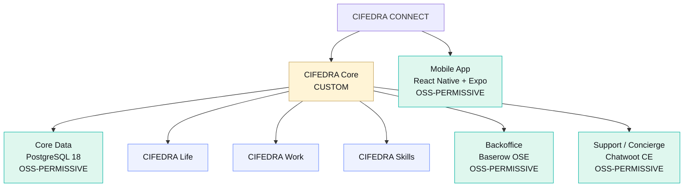
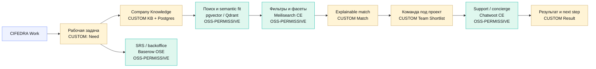
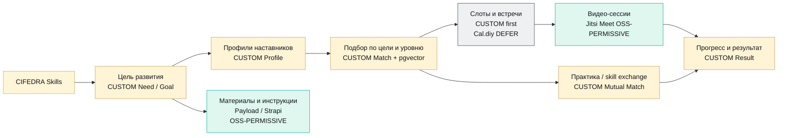
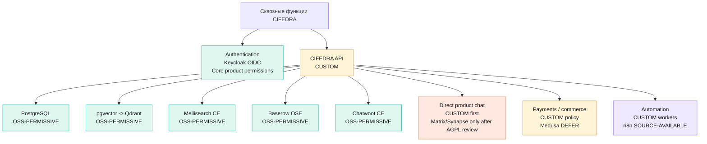
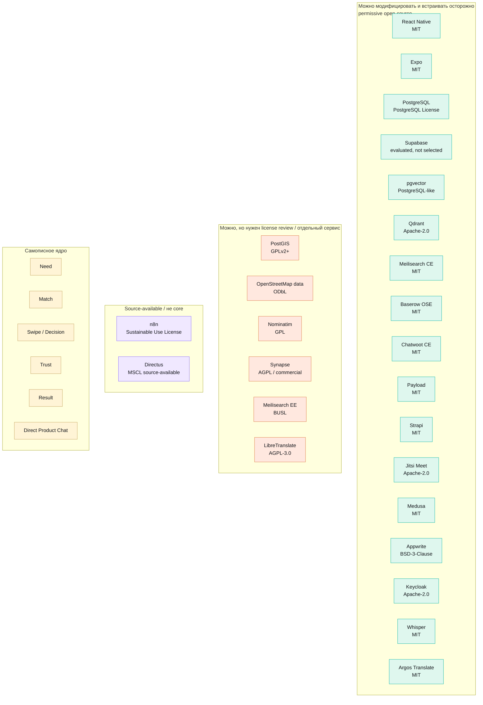

# CIFEDRA CONNECT: карта направлений, функций и решений

Дата: 2026-06-11
Статус: архитектурная карта v0.1
Связанные документы:

- [cifedra-connect-platform-selection.md](./cifedra-connect-platform-selection.md)
- [cifedra-connect-modifiable-solution-architecture.md](./cifedra-connect-modifiable-solution-architecture.md)
- [Целевая архитектура](../system/cifedra-target-architecture.md)

## Цель

Нарисовать карту `Life / Work / Skills`: какие функции нужны в каждом направлении и чем их закрывать - модифицируемым open-source решением или самописным модулем `CIFEDRA Core`.

## Легенда

| Маркер | Значение |
| --- | --- |
| `CUSTOM` | Самописный модуль. Здесь находится продуктовая логика CIFEDRA, ее нельзя отдавать внешнему движку. |
| `OSS-PERMISSIVE` | Open-source с permissive лицензией: MIT, Apache-2.0, BSD-3-Clause, PostgreSQL License. Можно модифицировать при соблюдении notice/license требований. |
| `OSS-COPYLEFT` | Open-source с copyleft лицензией: GPL/AGPL/ODbL. Модифицировать можно, но нужны лицензионные условия и review перед production. |
| `SOURCE-AVAILABLE` | Код доступен, но лицензия не является классическим OSI open-source или имеет дополнительные ограничения. Не использовать в core без review. |
| `DEFER` | Решение откладываем до отдельного SRS. |

## Общая карта

## Направление Life

`Life` закрывает бытовую, локальную, срочную и доверительную помощь. Здесь нельзя ограничиться каталогом людей: нужны география, доступность, безопасность, ручной dispatch на старте и обязательная фиксация результата.

```mermaid
flowchart LR
  Life["CIFEDRA Life"]

  LNeed["Формулировка задачи<br/>CUSTOM: Need"]
  LGeo["География и расстояние<br/>PostGIS OSS-COPYLEFT<br/>OSM/Nominatim OSS-COPYLEFT"]
  LProfiles["Каталог помощников<br/>CUSTOM Profile<br/>Baserow pilot OSS-PERMISSIVE"]
  LMatch["Локальный матчинг<br/>CUSTOM Match + Trust"]
  LSwipe["Карточки / свайпы / shortlist<br/>CUSTOM Mobile UX"]
  LConnect["Concierge / поддержка<br/>Chatwoot CE OSS-PERMISSIVE"]
  LResult["Итог контакта<br/>CUSTOM Result"]

  Life --> LNeed --> LGeo --> LProfiles --> LMatch --> LSwipe --> LConnect --> LResult

  classDef custom fill:#fff4d6,stroke:#c7a663,color:#111318
  classDef permissive fill:#dff7ee,stroke:#10b7a6,color:#111318
  classDef copyleft fill:#ffe8df,stroke:#df7b47,color:#111318
  classDef direction fill:#e8fbf8,stroke:#58c7b6,color:#111318

  class Life direction
  class LNeed,LMatch,LSwipe,LResult custom
  class LProfiles,LConnect permissive
  class LGeo copyleft
```

| Функция Life | Решение | Тип | Комментарий |
| --- | --- | --- | --- |
| `Home Help` / помощь по дому | `Need`, `Profile`, `Trust`, `Result` | `CUSTOM` | Разные риски: доступ в дом, качество, безопасность, повторный вызов. |
| `Local Tasks` / поручения рядом | `Need`, `Geo`, `Dispatch`, `Shortlist` | `CUSTOM + OSS` | Нужна срочность, расстояние, доступность и понятный результат. |
| `Move & Transport` / переезды | `Need`, `Capacity`, `Schedule`, `Trust` | `CUSTOM` | Груз, время, транспорт, стоимость и ответственность. |
| `Care` / забота и уход | `Trust`, `Verification`, `Result` | `CUSTOM` | Высокий риск, нужны проверки и строгие правила. |
| `Local Deals` / локальные сделки | `Match`, `Safety`, `Contact route` | `CUSTOM` | До commerce/SRS не подключать платежный движок. |
| Геопоиск | `PostGIS`, опционально `OSM/Nominatim` | `OSS-COPYLEFT` | PostGIS и Nominatim можно использовать, но изменения/распространение и OSM data требуют лицензионного review. |
| Ручной пилот | `Baserow OSE` | `OSS-PERMISSIVE` | Очереди заявок, каталог кандидатов, статусы ручного подбора. |
| Concierge | `Chatwoot CE` | `OSS-PERMISSIVE` | Канал помощи до появления direct product chat. |

## Направление Work

`Work` закрывает экспертов, исполнителей, команды, бизнес-сделки и корпоративное знание. Здесь главное - не просто найти человека, а объяснить релевантность и подготовить контакт.

| Функция Work | Решение | Тип | Комментарий |
| --- | --- | --- | --- |
| `Expert Help` / экспертная помощь | `CUSTOM Match`, `pgvector`, `Qdrant` | `CUSTOM + OSS-PERMISSIVE` | Нужен semantic fit, но объяснение матча делаем сами. |
| `Task Execution` / исполнение задач | `Profile`, `Capability`, `Availability`, `Result` | `CUSTOM` | Критичны роль, портфолио, ограничения, качество выполнения. |
| `Business Deals` / бизнес и сделки | `Need`, `Prepare`, `Contact route` | `CUSTOM` | Не сводится к CRM: нужен контекст и подготовка разговора. |
| `Project Team` / команда под проект | `Team Shortlist`, `Role Fit`, `Gap Analysis` | `CUSTOM` | Команда - это набор ролей и рисков, а не одиночный матч. |
| `Company Knowledge` / люди внутри компании | `Knowledge Base`, `pgvector`, `Postgres` | `CUSTOM + OSS-PERMISSIVE` | Связка человек-документ-система-решение. |
| Фасетный поиск | `Meilisearch CE` | `OSS-PERMISSIVE` | Использовать Community Edition; Enterprise/advanced features проверять отдельно. |
| Backoffice и SRS | `Baserow OSE` | `OSS-PERMISSIVE` | Реестр требований, статусы, вопросы, traceability, ручные очереди. |
| Автоматизации | `CUSTOM workers`; `n8n` только после review | `CUSTOM / SOURCE-AVAILABLE` | n8n source-available, не core. |

## Направление Skills

`Skills` закрывает обучение, наставничество, карьерную помощь, практику и обмен навыками. Здесь важны цель развития, уровень, формат взаимодействия, расписание и прогресс.

| Функция Skills | Решение | Тип | Комментарий |
| --- | --- | --- | --- |
| `Mentors` / менторы | `Goal`, `Profile`, `Match`, `Result` | `CUSTOM` | Нужна совместимость цели, опыта, формата и ожиданий. |
| `Learning Help` / обучение | `Content`, `Schedule`, `Result` | `CUSTOM + OSS` | Контент можно держать в Payload/Strapi, прогресс - в core. |
| `Career Help` / карьера | `Prepare`, `Review`, `Follow-up` | `CUSTOM` | Собственная логика: резюме, интервью, портфолио, стратегия. |
| `Practice Partners` / практика | `Mutual Match`, `Availability`, `Result` | `CUSTOM` | Это не каталог преподавателей, а совпадение целей и формата. |
| `Skill Exchange` / обмен навыками | `Mutual Value`, `Rules`, `Result` | `CUSTOM` | Требуются правила взаимности, ожиданий и отказа. |
| Встречи и слоты | `CUSTOM schedule`; позже `Cal.diy` | `CUSTOM / DEFER` | Сначала простые слоты в core; внешний scheduling после SRS. |
| Видео | `Jitsi Meet` | `OSS-PERMISSIVE` | Подключать как отдельный сервис, если видео станет частью MVP. |
| Материалы | `Payload` или `Strapi` | `OSS-PERMISSIVE` | Не хранить продуктовые профили людей в CMS. |

## Сквозные функции

| Сквозная функция | Основное решение | Тип | Решение |
| --- | --- | --- | --- |
| Мобильный клиент | React Native + Expo | `OSS-PERMISSIVE` | Основной UX для iOS/Android. |
| Authentication / SSO | Keycloak + Core authorization | `OSS-PERMISSIVE + CUSTOM` | Keycloak владеет credentials/session; Core владеет profile/permissions. |
| API and storage | Собственный API + PostgreSQL | `CUSTOM + OSS-PERMISSIVE` | Product state и бизнес-правила остаются в CIFEDRA. |
| Основные данные | PostgreSQL | `OSS-PERMISSIVE` | Системный источник истины. |
| Матчинг | CIFEDRA Match Engine | `CUSTOM` | Главная продуктовая ценность. |
| Векторный поиск | pgvector, позже Qdrant | `OSS-PERMISSIVE` | Только инфраструктура для поиска, не логика решения. |
| Фасетный поиск | Meilisearch CE | `OSS-PERMISSIVE` | Не брать Enterprise/BUSL features без review. |
| Backoffice | Baserow OSE | `OSS-PERMISSIVE` | Операционный слой, не production core. |
| Support / concierge | Chatwoot CE | `OSS-PERMISSIVE` | Не direct marketplace chat. |
| Direct product chat | Самописный, Matrix/Synapse только после review | `CUSTOM / OSS-COPYLEFT` | AGPL требует отдельного решения по раскрытию модификаций. |
| Встречи | Самописные слоты, потом review Cal.diy | `CUSTOM / DEFER` | Не внедрять внешний scheduling до SRS. |
| Видео | Jitsi Meet | `OSS-PERMISSIVE` | Отдельный сервис для Skills/Work. |
| Контент | Payload или Strapi | `OSS-PERMISSIVE` | Публичные инструкции, материалы, FAQ. |
| Языки и перевод | UI i18n + text translation adapter | `CUSTOM + INTEGRATE` | Оригинал хранится отдельно; provider заменяем. |
| Голос | Whisper/speech provider adapter | `OSS-PERMISSIVE / INTEGRATE` | Transcription и language detection, не универсальный text translator. |
| Платежи/commerce | Provider-neutral payment adapter | `CUSTOM / DEFER` | Локально mock; реальный PSP только перед production pilot после юридического SRS. |
| Автоматизации | Custom workers; n8n только внутренне | `CUSTOM / SOURCE-AVAILABLE` | n8n не использовать как core из-за Sustainable Use License. |

## Лицензионная карта компонентов

## Build / Modify / Integrate / Avoid

| Компонент | Решение |
| --- | --- |
| `Need`, `Match`, `Prepare`, `Result`, `Trust` | `BUILD`: самописное ядро. |
| Mobile UI, карточки, свайпы, shortlist | `BUILD`: самописный UX на React Native + Expo. |
| Authentication | `INTEGRATE/MODIFY`: Keycloak. |
| Storage and DB admin | `INTEGRATE`: PostgreSQL and migrations. |
| Geo | `INTEGRATE`: PostGIS; OSM/Nominatim только после license/data review. |
| Semantic search | `INTEGRATE`: pgvector; Qdrant при росте. |
| Backoffice и ручной пилот | `MODIFY`: Baserow OSE. |
| Support и concierge | `MODIFY`: Chatwoot CE. |
| Direct user-to-helper chat | `BUILD`: проектировать отдельно; Matrix/Synapse не брать без AGPL review. |
| Scheduling | `BUILD first`: простые слоты; Cal.diy/календарные интеграции позже. |
| Video | `INTEGRATE`: Jitsi Meet. |
| Translation / speech | `INTEGRATE`: provider adapters; Whisper only for speech tasks. |
| Content/help center | `MODIFY`: Payload или Strapi. |
| Automation | `BUILD/INTEGRATE`: custom workers; n8n только внутренне и после review. |
| Payments/commerce | `DEFINE/DEFER`: adapter и mock сейчас; реальный PSP после production readiness. |

## Источники лицензий и ограничений

- React Native: [MIT license](https://github.com/facebook/react-native/blob/main/LICENSE).
- Expo: [MIT license](https://github.com/expo/expo/blob/main/LICENSE).
- Supabase: [Apache-2.0 license](https://github.com/supabase/supabase/blob/master/LICENSE), [architecture docs](https://supabase.com/docs/guides/getting-started/architecture).
- PostgreSQL: [PostgreSQL License](https://www.postgresql.org/about/licence/).
- PostGIS: [GPL FAQ](https://postgis.net/documentation/faq/gpl-license/), [license file](https://github.com/postgis/postgis/blob/master/LICENSE.TXT).
- pgvector: [license](https://github.com/pgvector/pgvector/blob/master/LICENSE).
- Qdrant: [Apache-2.0 license](https://github.com/qdrant/qdrant).
- Meilisearch: [Community/Enterprise licensing](https://meilisearch.com/docs/resources/self_hosting/enterprise_edition), [LICENSE](https://github.com/meilisearch/meilisearch/blob/main/LICENSE).
- Baserow: [MIT/OSE license](https://github.com/baserow/baserow/blob/develop/LICENSE), [Baserow GitHub](https://github.com/baserow/baserow).
- Chatwoot: [MIT Community Edition FAQ](https://developers.chatwoot.com/self-hosted/faq), [Chatwoot GitHub](https://github.com/chatwoot/chatwoot).
- Appwrite: [BSD-3-Clause license](https://github.com/appwrite/appwrite/blob/1.9.x/LICENSE).
- Payload: [MIT license](https://github.com/payloadcms/payload/blob/main/LICENSE.md), [open source statement](https://payloadcms.com/get-started).
- Strapi: [MIT license](https://github.com/strapi/strapi/blob/develop/LICENSE), [open-source statement](https://strapi.io/).
- Jitsi Meet: [Apache-2.0 license](https://github.com/jitsi/jitsi-meet/blob/master/LICENSE), [Jitsi site](https://jitsi.org/).
- Medusa: [MIT license](https://github.com/medusajs/medusa).
- OpenStreetMap / Nominatim: [OSM ODbL](https://wiki.openstreetmap.org/wiki/Open_Database_License), [Nominatim license](https://github.com/osm-search/Nominatim).
- Matrix / Synapse: [Element Synapse AGPL/commercial note](https://github.com/element-hq/synapse), [Matrix.org](https://matrix.org/).
- n8n: [Sustainable Use License docs](https://docs.n8n.io/sustainable-use-license/), [GitHub license note](https://github.com/n8n-io/n8n).
- Directus: [MSCL license](https://directus.com/license), [GitHub license note](https://github.com/directus/directus).
- Keycloak: [documentation](https://www.keycloak.org/docs/latest/server_admin/), [Apache-2.0 license](https://github.com/keycloak/keycloak/blob/main/LICENSE.txt).
- Whisper: [OpenAI repository and MIT license](https://github.com/openai/whisper).
- Cal.diy: [self-hosting warning](https://github.com/calcom/cal.diy), [license change note](https://cal.com/blog/cal-diy-open-source-to-closed-source).

## Следующий шаг

Эту карту нужно превратить в три SRS:

1. `SRS-CIFEDRA-Core`: общие сущности и жизненный цикл `Need -> Match -> Prepare -> Connect -> Result`.
2. `SRS-Life-MVP`: локальная помощь, гео, доверие, dispatch, ручной пилот.
3. `SRS-Work-Skills-MVP`: эксперты, команды, наставники, встречи, knowledge base и прогресс.
