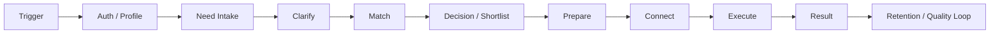

# CIFEDRA CONNECT: CJM сценарии и gap-анализ

Дата: 2026-06-20
Статус: product/system analysis v0.2

Связанные документы:

- [CJM по ролям](./cjm-by-roles.md).
- [Аудит CJM и Core](../system/core-cjm-gap-analysis.md).
- [Целевая архитектура](../system/cifedra-target-architecture.md).

## Назначение

Документ фиксирует список пользовательских сценариев в формате CJM и выделяет
шаги, функции и системные зоны, которые еще не учтены в текущем прототипе.

Основа текущего продукта:

```text
Need -> Match -> Prepare -> Connect -> Result
```

Этот жизненный цикл остается общим для направлений `Life`, `Work`, `Skills`.
Отличаются анкеты, правила подбора, доверие, тип результата, коммуникация и
риски.

## Метод CJM

Единые этапы CJM:

| Этап | Что проверяем |
| --- | --- |
| 1. Trigger | Почему пользователь пришел и насколько срочная потребность. |
| 2. Auth / Profile | Кто пользователь, какая роль, доверие, настройки и согласия. |
| 3. Need Intake | Как собираем потребность, контекст, ограничения и ожидаемый результат. |
| 4. Clarify | Какие уточняющие вопросы нужны до подбора. |
| 5. Match | Как ранжируем людей, объясняем подбор и учитываем риски. |
| 6. Decision | Как пользователь выбирает: свайп, shortlist, запрос контакта, отказ. |
| 7. Prepare | Как готовим brief, первый вопрос, риски и данные для передачи. |
| 8. Connect | Где происходит коммуникация: продуктовый чат, Chatwoot, звонок, внешний канал. |
| 9. Execute | Как отслеживаем выполнение: статус, дедлайн, задача в Plane, оператор. |
| 10. Result | Как фиксируем итог, качество, следующий шаг и влияние на scoring. |
| 11. Retention | Как возвращаем пользователя, предлагаем повторить или развить сценарий. |



## Что уже покрыто прототипом

| Зона | Текущее покрытие |
| --- | --- |
| Единая авторизация | `POST /auth/register`, `POST /auth/login`, `GET /auth/me`, bearer-session, actor для интеграций. |
| Демо-потребности | Три сценария: `Life / local task`, `Work / SRS review`, `Skills / interview prep`. |
| Matching | Базовый scoring и объяснение релевантности профилей. |
| Decision / shortlist | Начальные решения по кандидату: viewed, saved, rejected, requested contact. |
| Prepare | Brief контакта с контекстом, вопросами и рисками. |
| Conversation | Product-owned draft conversation, не Chatwoot как источник состояния. |
| Chatwoot | Live handoff в локальный Chatwoot с custom attributes CIFEDRA actor. |
| Plane | Draft handoff для задач исполнения. |
| Result | Outcome, next step, quality score, match quality signal. |
| Test Console | Локальная проверка цепочки и диагностика интеграций. |

## Реестр сценариев

### Общие сценарии платформы

| Сценарий | Для кого | Зачем нужен | Статус |
| --- | --- | --- | --- |
| Регистрация и вход | Клиент, помощник, оператор, админ | Единая идентичность для CIFEDRA и интеграций. | Частично покрыто. |
| Профиль пользователя | Клиент, помощник | Роли, доверие, направления, настройки, доступность. | Не покрыто. |
| Создание потребности | Клиент | Описать задачу и ожидаемый результат. | Частично покрыто demo API. |
| Уточнение потребности | Клиент, агент/оператор | Собрать недостающие параметры до matching. | Не покрыто. |
| Просмотр кандидатов | Клиент | Понять, почему человек подходит. | Частично покрыто. |
| Свайп / shortlist | Клиент | Сохранить, отклонить, запросить контакт. | Частично покрыто в core, нет UX/storage. |
| Передача в чат | Клиент, оператор | Начать коммуникацию с контекстом предыдущих шагов. | Частично покрыто Chatwoot handoff. |
| Передача в задачу | Оператор, исполнитель | Создать работу на исполнение и отслеживать статус. | Draft для Plane. |
| Фиксация результата | Клиент, оператор | Закрыть сценарий и улучшить будущий подбор. | Частично покрыто demo API. |
| Поддержка и эскалация | Клиент, оператор | Решать спор, жалобу, ошибку или риск. | Не покрыто. |

### Life

| Сценарий | Пример | Критичные особенности | Статус |
| --- | --- | --- | --- |
| Local Tasks | Забрать заказ рядом, отвезти вещь, сходить в точку. | География, время, доверие, подтверждение выполнения. | Demo-сценарий есть. |
| Home Help | Помощь дома, мелкие бытовые задачи. | Безопасность, доступ в помещение, проверка помощника. | Не покрыто. |
| Move & Transport | Перевозка, помощь с переездом. | Габариты, транспорт, цена, страховка. | Не покрыто. |
| Care | Помощь семье, детям, пожилым. | Максимальное доверие, квалификация, расписание, ответственность. | Не покрыто. |
| Local Deals | Местные услуги и предложения. | Каталог, фильтры, цены, отзывы. | Не покрыто. |

### Work

| Сценарий | Пример | Критичные особенности | Статус |
| --- | --- | --- | --- |
| Expert Help | Ревью SRS, консультация архитектора, разбор требований. | NDA, артефакты, роль эксперта, результат в документе. | Demo-сценарий есть. |
| Task Execution | Передать задачу исполнителю или команде. | ТЗ, статус, дедлайн, acceptance criteria, Plane. | Частично покрыто draft handoff. |
| Project Team | Собрать проектную группу. | Роли, загрузка, календарь, ответственность. | Не покрыто. |
| Business Deals | Найти партнера, подрядчика, поставщика. | Юр. контекст, условия, договоренности. | Не покрыто. |
| Company Knowledge | Найти внутреннее знание или эксперта. | Права доступа, поиск по базе знаний, цитируемость. | Не покрыто. |

### Skills

| Сценарий | Пример | Критичные особенности | Статус |
| --- | --- | --- | --- |
| Career Help | Подготовка к интервью, резюме, карьерный план. | Цель, уровень, формат, материалы, follow-up. | Demo-сценарий есть. |
| Mentors | Найти ментора по навыку или роли. | Расписание, формат, опыт, прогресс. | Не покрыто. |
| Learning Help | Помощь с темой, курсом, заданием. | Уровень, учебные материалы, домашние задания. | Не покрыто. |
| Practice Partners | Практика интервью, языка, навыка. | Парное расписание, правила сессии, повторяемость. | Не покрыто. |
| Skill Exchange | Обмен навыками между пользователями. | Баланс ценности, взаимность, репутация. | Не покрыто. |

## CJM 1. Life: локальное поручение рядом

Пример: пользователь хочет, чтобы помощник забрал заказ рядом и передал его.

| Этап | Пользователь | CIFEDRA / агент | Данные и интеграции | Не учтено |
| --- | --- | --- | --- | --- |
| Trigger | Понимает, что не успевает забрать заказ. | Определяет сценарий `Life / Local Tasks`. | Категория, срочность. | Быстрый вход без длинной анкеты. |
| Auth / Profile | Входит или регистрируется. | Создает principal и роль `client`. | CIFEDRA Auth. | Телефон, подтверждение, согласие на обработку данных. |
| Need Intake | Описывает задачу. | Валидирует описание и ожидаемый результат. | Need: адрес, время, описание. | Точный адрес, приватность адреса, окно времени, бюджет, фото/файл. |
| Clarify | Отвечает на уточнения. | Дособирает недостающие параметры. | Вопросы агента. | Автоматический список вопросов по `Life`. |
| Match | Видит подходящих помощников. | Учитывает географию, доверие, доступность. | Профили, trust signals. | Реальная геолокация, радиус, текущая доступность, blacklist. |
| Decision | Свайпает или сохраняет кандидата. | Формирует shortlist и выбранный контакт. | Decision/Shortlist. | Mobile UX свайпа, persistent decisions. |
| Prepare | Подтверждает, что можно связаться. | Формирует brief: задача, адрес, время, риски. | Conversation draft. | Маскирование персональных данных до согласия. |
| Connect | Пишет в чат или ждет оператора. | Открывает Chatwoot conversation с контекстом. | Chatwoot live. | Push-уведомления, SLA оператора, прямой чат без Chatwoot. |
| Execute | Отслеживает выполнение. | Может создать задачу для оператора/помощника. | Plane draft. | Статусы на карте, доказательство выполнения, отмена. |
| Result | Подтверждает результат. | Закрывает need и обновляет quality signal. | Result API. | Фото/код подтверждения, спор, жалоба, возврат. |
| Retention | Повторяет похожее поручение. | Предлагает сохраненного помощника. | История задач. | Избранные помощники, шаблоны поручений. |

## CJM 2. Work: ревью SRS

Пример: пользователь хочет быстро получить экспертное ревью требований перед
передачей в разработку.

| Этап | Пользователь | CIFEDRA / агент | Данные и интеграции | Не учтено |
| --- | --- | --- | --- | --- |
| Trigger | Нужно проверить SRS перед разработкой. | Определяет сценарий `Work / Expert Help`. | Категория, tags: SRS, review. | Контекст проекта и критичность срока. |
| Auth / Profile | Входит как клиент или сотрудник. | Создает principal и роли. | CIFEDRA Auth. | Компания, команда, права доступа, корпоративный SSO. |
| Need Intake | Описывает задачу ревью. | Собирает ожидаемый результат. | Need, expected result. | Загрузка файлов, ссылки на Confluence/Jira/Git, NDA. |
| Clarify | Уточняет тип ревью. | Спрашивает про формат: quick review, full review, checklist. | Вопросы агента. | Шаблоны вопросов по SRS, критерии приемки. |
| Match | Смотрит экспертов. | Ранжирует по роли, опыту, домену, SRS-навыкам. | Профили экспертов. | Availability, ставка, конфиденциальность, conflict of interest. |
| Decision | Выбирает эксперта. | Сохраняет решение и brief. | Decision/Shortlist. | Сравнение экспертов, запрос коммерческого предложения. |
| Prepare | Передает материалы. | Готовит brief, риски, первый вопрос. | Conversation draft. | Redaction секретных данных, чеклист ревью. |
| Connect | Обсуждает с экспертом/оператором. | Передает контекст в Chatwoot. | Chatwoot live. | Передача файлов в чат, история решений. |
| Execute | Ждет результат ревью. | Создает task в Plane или связывает с project work item. | Plane draft. | Статус исполнения, deadline, acceptance criteria, assignee. |
| Result | Получает замечания и правки. | Закрывает need, фиксирует качество. | Result API. | Хранение итогового артефакта, оценка полезности по пунктам. |
| Retention | Просит следующее ревью. | Предлагает того же эксперта или команду. | История, quality loop. | Пакеты услуг, база лучших практик, повторные шаблоны. |

## CJM 3. Skills: подготовка к интервью

Пример: пользователь хочет подготовиться к интервью системного аналитика.

| Этап | Пользователь | CIFEDRA / агент | Данные и интеграции | Не учтено |
| --- | --- | --- | --- | --- |
| Trigger | Нужно подготовиться к интервью. | Определяет сценарий `Skills / Career Help`. | Категория, цель. | Диагностика уровня и даты интервью. |
| Auth / Profile | Входит или регистрируется. | Создает principal и роль. | CIFEDRA Auth. | Образовательный профиль, опыт, цели развития. |
| Need Intake | Описывает вакансию и слабые места. | Собирает expected result. | Need, tags. | CV, ссылка на вакансию, желаемый формат, бюджет. |
| Clarify | Отвечает на вопросы по уровню. | Уточняет hard/soft skills, язык, формат интервью. | Вопросы агента. | Диагностический опросник и карта навыков. |
| Match | Смотрит менторов. | Ранжирует по роли, опыту, формату и доступности. | Профили менторов. | Расписание, часовые пояса, язык, формат video/chat. |
| Decision | Выбирает ментора. | Формирует shortlist. | Decision/Shortlist. | Сравнение программ, trial session. |
| Prepare | Подтверждает формат подготовки. | Готовит brief и первый план сессии. | Conversation draft. | План занятия, материалы до встречи. |
| Connect | Общается с ментором. | Открывает чат или сессию. | Chatwoot live сейчас, будущий video. | Booking, видео-ссылка, напоминания. |
| Execute | Проходит занятие. | Отслеживает сессию как задачу/событие. | Plane draft или календарь. | Homework, notes, запись занятия, прогресс. |
| Result | Оценивает пользу. | Фиксирует outcome и next step. | Result API. | План follow-up, чеклист навыков, повторная сессия. |
| Retention | Продолжает подготовку. | Предлагает программу и следующих помощников. | История, progress. | Learning path, subscription, streaks. |

## CJM 4. Единая авторизация для интеграций

Этот сценарий сквозной: он нужен до полноценной мобильной сборки и до глубоких
интеграций с Plane/Chatwoot.

| Этап | Пользователь | CIFEDRA | Интеграция | Не учтено |
| --- | --- | --- | --- | --- |
| Регистрация | Создает аккаунт. | Создает `AuthUser`, session и principal. | Не получает пароль. | Email/phone confirmation, captcha/rate limit. |
| Вход | Вводит email/password. | Выдает bearer token. | Получает только claims. | Refresh token, device management, biometric unlock. |
| Передача контекста | Запускает сценарий. | Добавляет actor к handoff. | Chatwoot custom attributes, Plane description. | Поля Plane, единая identity mapping table. |
| Работа в UI интеграции | Может попасть в Chatwoot/Plane UI. | Должна быть источником identity. | Должна доверять CIFEDRA. | OIDC/SAML/reverse proxy SSO. |
| Аудит | Делает действия. | Логирует кто и что передал. | Возвращает external refs. | Audit log, security events, privacy trail. |

## Gap register

### P0. До Mobile MVP и локального end-to-end теста

| Gap | Почему это P0 | Рекомендуемое направление |
| --- | --- | --- |
| Persistent storage для users, needs, matches, decisions, conversations, results. | Сейчас состояние демо в памяти/локальных файлах, mobile не сможет работать стабильно. | Backend / Data. |
| Профиль пользователя и роли `client/helper/operator/admin`. | Без профиля невозможно доверие, доступность и персонализация matching. | Auth / Profile. |
| Direction-specific intake forms. | `Life`, `Work`, `Skills` требуют разных обязательных полей. | Core / Product. |
| Уточняющие вопросы до matching. | Сейчас matching стартует без проверки полноты данных. | Core / Agents. |
| Хранение свайпов и shortlist. | В core есть модель, но нет долговременного UX-состояния. | Mobile / API. |
| Trust & safety baseline. | Life и Care нельзя запускать без проверок, жалоб, блокировок и правил раскрытия данных. | Security / Operations. |
| Notifications. | Без push/email/in-app пользователь не узнает о ответе, статусе и результате. | Mobile / Backend. |
| Operator/backoffice queue. | Chatwoot есть, но нет продуктовой очереди исключений и ручной диспетчеризации. | Operations / Backoffice. |
| Backoffice data model for Baserow pilot. | Для ручного пилота нужны таблицы потребностей, кандидатов, назначений, статусов и результатов. | Backoffice / Baserow. |
| Integration event sync. | Нужно возвращать статусы Chatwoot/Plane обратно в CIFEDRA Core. | Integrations. |
| Production auth basics. | Нужны reset password, session expiry, refresh, confirmation, audit. | Auth. |

### P1. После базового mobile MVP

| Gap | Направления | Суть |
| --- | --- | --- |
| География и карта | Life | Радиус, район, маршрут, приватность адреса, доступность рядом. |
| Цена и условия | Life, Work, Skills | Бюджет, ставка, оплата, бесплатная консультация, условия отмены. |
| Файлы и артефакты | Work, Skills | Загрузка SRS, CV, вакансии, результатов, материалов. |
| Расписание и booking | Skills, Work, Care | Календарь, слоты, часовые пояса, перенос/отмена. |
| Video/session layer | Skills, Work | Ссылка на звонок, заметки, запись, итоги. |
| Company knowledge permissions | Work | Доступ к внутренним базам, цитирование, разграничение прав. |
| Outcome taxonomy по направлениям | Все | Разные результаты и причины неуспеха для Life/Work/Skills. |
| Языки и перевод | Все | Locale, spoken/required languages, text translation and transcript metadata. |
| Голосовой ввод | Все | Audio consent, media storage, transcription provider and confidence. |
| Price/payment contract | Life, Work, Skills | Money, terms and mock payment provider без реальных транзакций. |

### P2. Масштабирование продукта

| Gap | Для чего |
| --- | --- |
| Real payments / billing / payouts. | Коммерческие сценарии после production readiness и юридического SRS. |
| Reviews and reputation. | Доверие, удержание, качество matching. |
| Disputes and refunds. | Разбор спорных случаев. |
| Direct product chat. | Замена части Chatwoot и контроль UX в мобильном приложении. |
| Full SSO into integrated apps. | Бесшовный вход в Plane/Chatwoot UI. |
| Recommendation learning loop. | Автоматическое улучшение matching по результатам. |

## Функциональный backlog из CJM

| Функция | Направления | Текущее покрытие | Что нужно добавить |
| --- | --- | --- | --- |
| User profile | Все | Только auth user/principal. | Роли, направления, trust, availability, preferences. |
| Need wizard | Все | Demo payload. | Формы по категориям, валидация, черновики, вложения. |
| Clarification agent | Все | Нет. | Список недостающих полей и вопросы до matching. |
| Direction scoring rules | Все | Первая версия реализована: Life geo/trust, Work role/context, Skills goal/level/format. | Калибровка весов по quality signals и добавление schedule/availability. |
| Candidate cards | Все | API возвращает candidates. | Mobile UI, объяснение, trust, цена, availability. |
| Swipe decisions | Все | Core model есть. | API storage, история, undo, shortlist. |
| Conversation state | Все | Draft/open/result в demo. | Webhooks, SLA, участники, история сообщений. |
| Baserow pilot tables | Operations | Пока только архитектурная гипотеза. | Таблицы needs, profiles, assignments, conversations, results, операторские views. |
| Plane task sync | Work, Operations | Draft handoff. | Live task create/update, status mapping, assignee mapping. |
| Chatwoot outcome sync | Все | Live create только частично. | Webhooks, закрытие conversation, outcome mapping. |
| Result UX | Все | Demo endpoint. | Экран результата, причины, rating, следующий шаг. |
| Notifications | Все | Нет. | Push/email/in-app события. |
| Moderation and safety | Все, особенно Life/Care | Нет. | Report, block, audit, verification, risk flags. |
| Knowledge artifacts | Work, Skills | Нет. | SRS/CV/materials storage, versioning, permissions. |
| Booking | Skills, Work, Care | Нет. | Slots, calendar, reminders, reschedule/cancel. |

## Аналитические агенты и зоны ответственности

| Агент | Что проверяет в CJM |
| --- | --- |
| Product Analyst | Ценность сценария, сегменты, retention, метрики. |
| System Analyst | Требования, статусы, сущности, API-контракты, SRS. |
| Business Analyst | Операционные процессы, роли, регламенты, экономика сценария. |
| Integration Analyst | Plane/Chatwoot/Baserow, события, webhooks, external refs. |
| QA Analyst | E2E-сценарии, негативные кейсы, smoke/regression. |
| Support / Ops Analyst | Очереди, эскалации, инструкции оператора, SLA. |
| Security Analyst | Auth, consent, privacy, audit, trust and safety. |

## Решения по результатам анализа

1. Keycloak становится источником authentication в staging/production, а
   CIFEDRA Core владеет product profile and permissions. Plane/Chatwoot не
   становятся местом регистрации пользователя.
2. Chatwoot conversation создаем после `Match -> Prepare` и явного действия
   пользователя/оператора, чтобы не засорять поддержку сырыми потребностями.
3. Plane task создаем только для сценариев, где есть исполнение, дедлайн или
   операционный контроль. Не каждое общение должно становиться задачей.
4. Baserow используем как быстрый backoffice-пилот для ручного контроля, но не
   как долгосрочный источник доменной модели.
5. `Result` обязателен для каждого сценария, иначе matching не сможет обучаться
   на качестве.
6. `Life`, `Work`, `Skills` должны получить собственные intake-схемы и scoring
   rules, но общий lifecycle не меняем.

## Следующий порядок работ

1. Превратить этот CJM в SRS `Mobile MVP`.
2. Описать direction-specific schemas для `Need Intake`.
3. Добавить persistent storage и API DTO для `Need`, `Decision`, `Shortlist`,
   `Conversation`, `Result`.
4. Спроектировать operator/backoffice queue.
5. Описать Baserow pilot tables для ручного операционного контура.
6. Подключить webhooks/outcome sync из Chatwoot и Plane.
7. Подготовить E2E test cases по трем demo-сценариям.
