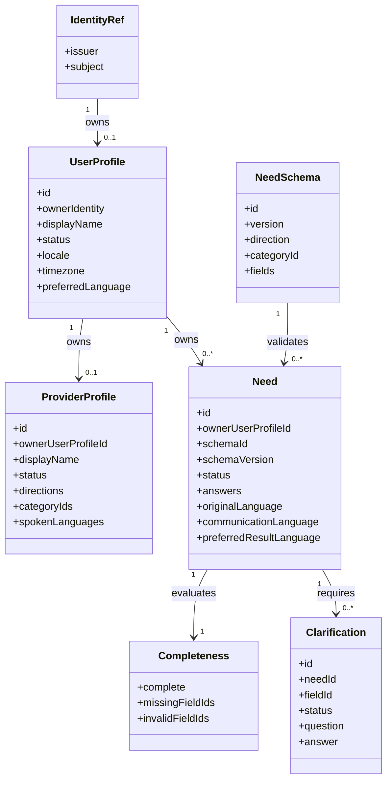
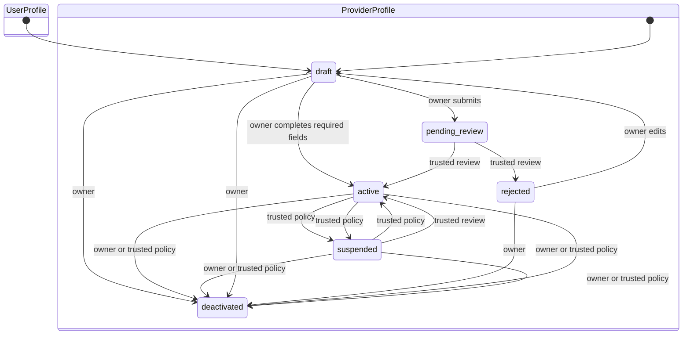
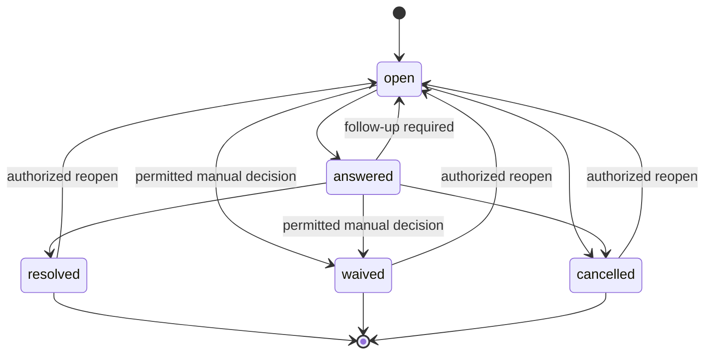
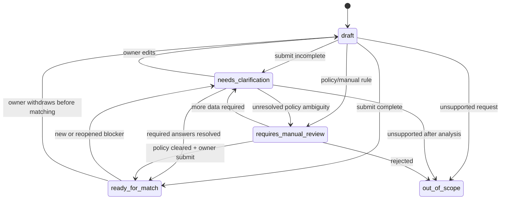

# SRS: Core P0 Identity, Profile, Intake and Clarification

Дата: 2026-06-21
Версия: 0.2
Статус: reviewed draft; implementation blocked on PA-007, PA-010 and PA-013
Sprint: 2026-06-22 - 2026-07-03

## 1. Назначение

SRS определяет первый Core P0 increment:

```text
Identity
  -> Profile
  -> Need Intake
  -> Clarification
  -> Ready for Match
```

Требования являются общими для направлений `Life`, `Work`, `Skills`.
Локальный pilot использует три category schemas:

- `Life / Outdoor maintenance`;
- `Work / SRS Review`;
- `Skills / Interview preparation`.

## 2. Scope

### In scope

- provider-neutral identity reference;
- client and provider product profiles;
- ownership and minimum authorization policy;
- Russian/English locale and language metadata;
- versioned category-specific Need schema;
- structured answers and completeness;
- Clarification questions, answers and lifecycle;
- переход Need к `ready_for_match`;
- domain errors and acceptance tests.

### Out of scope

- credentials, password reset, MFA and Keycloak runtime;
- organization membership;
- persistent repositories and migrations;
- API DTO/OpenAPI;
- ContactRequest and provider acceptance;
- consent and disclosure;
- communication, execution and Result;
- runtime machine translation;
- files, links and confidential SRS content;
- pricing, payment and payout;
- production audit implementation.

## 3. Product assumptions requiring confirmation

| ID | Assumption | Recommended baseline |
| --- | --- | --- |
| PA-001 | Local pilot scenarios | Life outdoor maintenance, Work SRS Review, Skills interview preparation. Accepted. |
| PA-002 | Pilot environment | Local and repository-owned synthetic fixtures only; no external participant data or real service delivery. Accepted. |
| PA-003 | Translation | Russian/English UI and future runtime online text translation. Accepted. |
| PA-004 | Provider selection | Explainable shortlist with explicit client choice; swipe is presentation only. Accepted. |
| PA-005 | First communication | Concierge flow through CIFEDRA/Chatwoot adapter. Accepted. |
| PA-006 | Commercial mode | Local pilot free; future platform fee paid by providers/companies. Accepted. |
| PA-007 | Quick Review maximum | Proposed: up to 25 pages or 10,000 words equivalent; pending confirmation. |
| PA-008 | Artifact before engagement | Synthetic metadata required; file accepted only after D0 and engagement policy. Accepted. |
| PA-009 | Review focus | Exactly one primary focus per Quick Review. Accepted. |
| PA-010 | Minimum deadline | Proposed: at least one business day; pending confirmation. |
| PA-011 | Provider public preview | Name, summary, capabilities, languages, trust and availability; contacts hidden until mutual match. Accepted. |
| PA-012 | Decision boundary | Core calculates readiness after owner submission; operator assists analysis but does not choose provider or accept request. Accepted. |
| PA-013 | Life schema variants | Proposed: one outdoor-maintenance schema, exactly one service variant per Need; pending confirmation. |

Assumptions affect later increments. Current Core contract must remain valid if
they change.

Candidate category schemas below are draft product configurations. They shall
not enter implementation until pending PA-007, PA-010 and PA-013 decisions are
accepted or explicitly deferred by the product owner.

## 4. Actors

| Actor | Description |
| --- | --- |
| Anonymous | Неаутентифицированный пользователь. |
| Client | Владелец client profile and Need. |
| Provider | Владелец provider profile; будущий исполнитель/эксперт. |
| Operator | Поддерживает intake and clarification в разрешенном scope. |
| Administrator | Управляет platform configuration; не получает автоматического ownership пользовательских ресурсов. |
| System | Выполняет deterministic validation and completeness calculation. |

Authentication roles and product roles are separate concepts. Self-registration
grants only client access and must not grant `helper`, `operator` or
`administrator`.

## 5. Domain model



## 6. Identity requirements

### Functional requirements

| ID | Requirement |
| --- | --- |
| IDN-001 | Core shall represent identity through `issuer + subject`. |
| IDN-002 | Email shall not be used as stable identity key. |
| IDN-003 | `issuer` and `subject` shall be non-empty normalized strings. |
| IDN-004 | Resolving the same issuer and subject shall idempotently return the same IdentityRef. |
| IDN-005 | Identities with different issuer or subject shall be distinct. |
| IDN-006 | Core shall accept normalized principals from local auth or future OIDC adapters without storing credentials. |
| IDN-007 | Only a trusted authentication adapter shall create an IdentityRef used by commands. |
| IDN-008 | Client commands shall not accept arbitrary owner identity or privileged roles from request payload. |

### Invariants

1. Identity key is immutable inside a profile or Need.
2. Credentials do not enter Core domain entities.
3. Display name and email changes do not change ownership.
4. Repeated trusted mapping of the same identity is idempotent.

### Identity normalization

- `issuer` is supplied only by a trusted adapter;
- OIDC issuer uses a validated absolute URI without query or fragment;
- scheme and host are lowercase; path remains case-sensitive;
- trailing slash is not silently added or removed;
- local adapter uses the fixed issuer `cifedra-local`;
- `subject` is an opaque case-sensitive identifier and is not Unicode- or
  case-normalized;
- surrounding whitespace and control characters are rejected, not trimmed.

## 7. Profile requirements

### Profile types

`UserProfile` contains common client-facing preferences.

`ProviderProfile` contains discoverable service capabilities. One identity may
own both profiles. Current P0 cardinality is at most one `UserProfile` and one
`ProviderProfile` per identity.

### Functional requirements

| ID | Requirement |
| --- | --- |
| PRF-001 | UserProfile shall have immutable owner `IdentityRef`; ProviderProfile shall have immutable owner `UserProfile.id`. |
| PRF-002 | A client may read and update only own user profile. |
| PRF-003 | A provider may read and update only own provider profile. |
| PRF-004 | Operator access shall require an explicit permission and shall not transfer ownership. |
| PRF-005 | User profile status shall support `draft`, `active`, `suspended`, `deactivated`; provider status shall support `draft`, `pending_review`, `active`, `rejected`, `suspended`, `deactivated`. |
| PRF-006 | A suspended profile shall not be eligible for matching. |
| PRF-007 | Common profile shall store display name, locale, timezone and preferred content language. |
| PRF-008 | Provider profile shall store directions, categories, capabilities, spoken languages and availability. |
| PRF-009 | Provider directions and categories shall be validated against the catalog. |
| PRF-010 | Profile update shall reject unsupported locale/language and invalid timezone. |
| PRF-011 | Admin role alone shall not permit editing user-owned product data without explicit policy. |
| PRF-012 | New profiles shall be private by default. |
| PRF-013 | Provider public preview shall expose only approved display fields and never email, contacts or IdP claims. |
| PRF-014 | User shall create a draft provider profile without receiving a privileged auth role. |
| PRF-015 | ProviderProfile shall support structured category capability records for future explainable matching. |

### Initial language support

- supported content languages: `ru`, `en`;
- supported UI locales: `ru-RU`, `en-US`;
- timezone: valid IANA timezone identifier;
- provider may have one or more spoken languages;
- profile may store optional country/region for later legal availability rules;
- original and translated content are separate in later increments.

### Profile lifecycle



Local synthetic fixtures may be seeded as active through a trusted test
adapter. Self-registration cannot activate a provider.

Provider status commands:

| Command | Allowed actor |
| --- | --- |
| Submit draft for review | Provider owner. |
| Activate or reject | Operator assigned to review with `provider.review`. |
| Suspend or restore | Trusted actor with `provider.suspend`. |
| Deactivate | Provider owner or trusted actor with explicit reason. |

Generic profile update command cannot change lifecycle status.

### Visibility baseline

Private:

- IdentityRef;
- email and IdP claims;
- timezone and country/region;
- communication preferences;
- profile draft fields and internal moderation state.

Provider public preview after activation:

- display name;
- summary;
- directions/categories/capabilities;
- spoken languages;
- availability;
- approved trust signals.

### Structured provider capabilities

Each ProviderProfile may contain versioned `ServiceCapability` records:

```text
categoryId
capabilitySchemaId
capabilitySchemaVersion
answers
status
```

Local fixtures include:

- Life: supported service variant, synthetic service region, equipment model;
- Work: supported artifact types, review focus, maximum size, languages;
- Skills: supported roles/seniority, interview types, formats, languages.

These records are not free-form tags and are validated by capability schemas.

## 8. Need Intake requirements

### Generic requirements

| ID | Requirement |
| --- | --- |
| INT-001 | Every Need shall reference an active owner `UserProfile.id`; authenticated identity is resolved through that profile. |
| INT-002 | Every Need shall reference `schemaId + schemaVersion`. |
| INT-003 | Schema shall belong to the Need direction and category. |
| INT-004 | Core shall validate answers by field type, required flag and constraints. |
| INT-005 | Completeness shall return `complete`, `missingFieldIds` and `invalidFieldIds`. |
| INT-006 | Completeness calculation shall be deterministic for the same schema and answers. |
| INT-007 | Only the Need owner may change answers. Operator may create clarification or analysis but cannot edit owner answers. |
| INT-008 | Need shall store original content language, communication language and preferred result language as aggregate metadata. |
| INT-009 | Machine translation shall not replace original answers. |
| INT-010 | Unknown schema or unsupported version shall be rejected. |
| INT-011 | A Need with missing or invalid required fields shall not enter matching. |
| INT-012 | Current increment shall reject files, external document links and confidential document payloads. |
| INT-013 | Published schema version shall be immutable; field changes shall create a new version. |
| INT-014 | Need shall retain the exact schema version used when created. |
| INT-015 | Client shall not set completeness or lifecycle status directly. |
| INT-016 | Mutable Need shall carry an aggregate version and reject stale updates. |
| INT-017 | NeedSchema lifecycle shall support `draft`, `published`, `deprecated`. |
| INT-018 | New Need shall use only a published schema; existing Need shall continue validating against its pinned deprecated version. |
| INT-019 | Local UAT shall accept only repository-owned synthetic fixtures; external participant free text, files and links are prohibited. |
| INT-020 | Local UAT entrypoint shall accept `fixtureId + predefinedActionId`, resolve them through a read-only fixture registry and reject unknown/ad-hoc payloads. |

Local fixture contract:

```text
id
schemaId
schemaVersion
ownerProfileFixtureId
initialAnswers
predefinedActions
expectedState
checksum
```

Fixture registry is version-controlled and read-only at runtime. `dataMode`
alone is not proof of synthetic provenance.

Language metadata is not duplicated in category answer fields.

### Field types and rules

Initial schema engine supports:

- short text;
- long text;
- single choice;
- multiple choice;
- boolean;
- integer;
- date/time;
- language code.

Files, money, geography and complex nested structures are future field types.

Initial limits:

- short text: 1-200 characters;
- long text: 1-5,000 characters per answer;
- multiple choice: no duplicates and only schema-defined values;
- unknown fields are rejected;
- control characters and structurally invalid values are rejected.

Declarative schema rules support:

- `required`;
- `required_when` by another field value;
- `allowed_values`;
- `min_items` and `max_items`;
- `min_value` and `max_value`;
- `future_datetime`;
- `numeric_limit_by_unit`;
- `forbidden_content_kind`;
- `exactly_one`.

Category-specific readiness shall be represented by these rule declarations,
not hardcoded `if direction == ...` branches in the generic engine.

### Schema lifecycle

Catalog administrator may publish a draft schema. Published schema is
immutable. Deprecation prevents new Need creation but does not invalidate
existing Need instances pinned to that version.

All three schemas may be technically `published` only inside the isolated local
test registry so immutability and version pinning can be tested. This status
does not authorize external users or represent product validation. External
publication requires a later product gate.

## 9. Work/SRS Review schema v1

Schema identity:

```text
schemaId: work.srs-review
version: 1
direction: work
categoryId: work.expert-help
```

### Required fields

| Field ID | Type | Purpose |
| --- | --- | --- |
| `reviewType` | single choice | `quick_review`; additional types require later schema version. |
| `requesterRole` | single choice | `analyst`, `delivery_product`, `engineering`, `founder`, `other`. |
| `artifactType` | single choice | `srs`, `requirements_specification`, `api_requirements`, `change_requirements`, `other`. |
| `artifactStage` | single choice | `draft`, `pre_estimation`, `pre_development`, `change_review`. |
| `documentAudience` | multiple choice | `business`, `development`, `testing`, `architecture`, `operations`. |
| `reviewGoal` | long text | Какое решение должен поддержать review. |
| `systemContext` | long text | Назначение системы и границы рассматриваемого изменения. |
| `expectedResult` | long text | Как клиент поймет, что review полезно. |
| `artifactSizeValue` | integer | Positive size value. |
| `artifactSizeUnit` | single choice | `pages` or `words`; schema default limits are 25 pages / 10,000 words pending product confirmation. |
| `reviewFocus` | single choice | Exactly one: completeness, consistency, ambiguity, testability, acceptance, data, integrations, NFR. |
| `desiredDeadline` | date/time | Desired future deadline; it is not an SLA and has no minimum until PA-010 is approved. |
| `dataMode` | single choice | Only `synthetic` in local pilot. |
| `serviceFormat` | single choice | Recommended baseline: `online`. |

### Optional fields

| Field ID | Type | Purpose |
| --- | --- | --- |
| `knownConcerns` | long text | Известные опасения клиента. |
| `openBusinessDecisions` | long text | Решения, которые еще не приняты. |
| `preferredInteraction` | single choice | `async`, `chat`, `debrief`; not used for readiness in current increment. |
| `budgetRange` | short text | Discovery signal only; not used for readiness. |
| `artifactTypeOther` | long text | Required when `artifactType=other`. |

### Readiness rule

Need is ready for matching only when:

1. all required fields are present and valid;
2. no open blocking Clarification remains;
3. `dataMode=synthetic` and input belongs to a repository-owned fixture;
4. artifact metadata is present and inside the approved Quick Review limits;
5. desired deadline is valid and not in the past; no turnaround promise is inferred;
6. Need aggregate languages are supported;
7. client Profile contains locale, timezone and communication language;
8. owner explicitly submits the Need;
9. Core, not client/operator, calculates readiness.

## 9A. Life/Outdoor Maintenance schema v1

Schema identity:

```text
schemaId: life.outdoor-maintenance
version: 1
direction: life
categoryId: life.home-help
```

For local pilot, pool cleaning and lawn mowing are service variants of one
schema. This does not create a new catalog category before product evidence.

### Required fields

| Field ID | Type | Purpose |
| --- | --- | --- |
| `serviceType` | single choice | Exactly one: `pool_cleaning` or `lawn_mowing`. |
| `serviceRegionId` | single choice | Repository-owned synthetic service region; exact address is forbidden. |
| `desiredDate` | date | Requested future date interpreted in owner Profile timezone. |
| `propertyContext` | long text | Outdoor property context without identifying address. |
| `expectedResult` | long text | Observable expected outcome. |
| `accessPresence` | single choice | `client_present`, `provider_independent`, `to_be_agreed`. |
| `dataMode` | single choice | Only `synthetic` in the local pilot. |
| `serviceFormat` | single choice | `in_person`; execution remains synthetic in local pilot. |

### Conditional fields

| Field ID | Condition | Type | Purpose |
| --- | --- | --- | --- |
| `poolSizeValue` | `pool_cleaning` selected | integer | Positive approximate pool size. |
| `poolSizeUnit` | `pool_cleaning` selected | single choice | `square_meters` or `cubic_meters`. |
| `poolCondition` | `pool_cleaning` selected | single choice | `routine`, `dirty`, `algae`, `unknown`. |
| `lawnAreaM2` | `lawn_mowing` selected | integer | Positive approximate lawn area. |
| `terrainCondition` | `lawn_mowing` selected | single choice | `flat`, `mixed`, `difficult`, `unknown`. |

### Optional fields

- additional notes.

Additional required fields:

| Field ID | Type | Purpose |
| --- | --- | --- |
| `preferredTimeWindow` | single choice | `morning`, `afternoon`, `evening`, `flexible`. |
| `equipmentResponsibility` | single choice | `client`, `provider`, `to_be_agreed`. |
| `accessConstraints` | long text | Constraints or explicit `none`. |
| `safetyConcerns` | long text | Known concerns or explicit `none`. |

### Readiness additions

Life Need is ready only when:

1. exactly one service type is selected;
2. all conditional fields for selected variants are valid;
3. desired date is in the future;
4. exact address, personal contacts and real property identifiers are absent;
5. `dataMode=synthetic`.

## 9B. Skills/Interview Preparation schema v1

Schema identity:

```text
schemaId: skills.interview-preparation
version: 1
direction: skills
categoryId: skills.career-help
```

### Required fields

| Field ID | Type | Purpose |
| --- | --- | --- |
| `targetRole` | short text | Role for which the client prepares. |
| `targetSeniority` | single choice | `intern`, `junior`, `middle`, `senior`, `lead`, `executive`. |
| `domainContext` | short text | Professional/product domain for matching. |
| `currentSeniority` | single choice | Same scale as `targetSeniority`. |
| `interviewTypes` | multiple choice | `hr`, `technical`, `case`, `system_design`, `behavioral`. |
| `preparationGoal` | single choice | Exactly one: `answers`, `mock_interview`, `resume_story`, `case_practice`, `feedback`. |
| `targetTimeline` | single choice | `within_week`, `within_month`, `exploring`. |
| `interviewLanguage` | language code | Language expected during interview. |
| `vacancyContext` | long text | Repository-owned synthetic vacancy/context summary. |
| `expectedResult` | long text | Desired observable preparation outcome. |
| `preferredFormat` | single choice | `video`, `chat`, `async`. |
| `sessionDurationMinutes` | single choice | `30`, `45`, `60`; one session in local pilot. |
| `dataMode` | single choice | Only `synthetic`; no real CV/vacancy data. |

### Optional fields

- professional experience summary;
- weak areas;
- interview date;
- accessibility/communication preferences.

### Readiness additions

Skills Need is ready only when:

1. target role, target/current seniority, domain and at least one interview type are known;
2. exactly one preparation goal is selected;
3. interview, communication and result languages and format are supported;
4. no real CV, vacancy file or confidential employer data is included;
5. `mock_interview` uses `video` or `chat`, not `async`;
6. session duration is selected;
7. no blocking clarification remains.

## 10. Clarification requirements

### Lifecycle



### Functional requirements

| ID | Requirement |
| --- | --- |
| CLR-001 | Clarification shall reference one Need and one schema field or explicit general topic. |
| CLR-002 | Clarification shall store requester actor, question, status and timestamps. |
| CLR-003 | Only Need owner may submit the client answer. Operator may explain the question but cannot answer on behalf of owner. |
| CLR-004 | Operator or System may create a clarification for missing/invalid data. |
| CLR-005 | System shall resolve schema-based clarification after a valid answer; operator may resolve only a non-blocking non-schema ambiguity with explicit permission and reason. |
| CLR-006 | Reopening a clarification shall preserve previous answer history. |
| CLR-007 | Resolved or cancelled clarification shall reject a new answer unless reopened through a valid transition. |
| CLR-008 | Open blocking clarification shall prevent `ready_for_match`. |
| CLR-009 | Answer update shall recalculate Need completeness. |
| CLR-010 | Questions and answers shall store original language. |
| CLR-011 | Machine-translated variants shall be metadata records and shall not overwrite original text. |
| CLR-012 | Clarification shall store reason `missing`, `ambiguous`, `conflicting`, `policy` or `out_of_scope`. |
| CLR-013 | Clarification shall declare whether it is blocking. |
| CLR-014 | Waiver shall require explicit permission, actor and reason. |
| CLR-015 | Mutable Clarification shall carry aggregate version and reject stale updates. |
| CLR-016 | Answer, clarification resolution and Need reassessment shall be one atomic application operation using expected Need and Clarification versions. |
| CLR-017 | For field-bound clarification, accepted answer shall become the authoritative value in `Need.answers[fieldId]`; Clarification keeps immutable answer history and references the applied Need version. |
| CLR-018 | Creating or reopening a blocking clarification and reassessing Need shall be atomic; a ready Need returns to `needs_clarification`. |

Waiver semantics:

- missing or invalid required schema field cannot be waived to
  `ready_for_match`;
- non-blocking ambiguity may be waived with actor and reason;
- policy/out-of-scope blocker may route Need to `requires_manual_review` or
  `out_of_scope`, not silently to ready;
- cancellation does not satisfy a required field.

## 11. Need lifecycle for the increment



`matching`, `matched`, `cancelled`, `expired` and later execution states are
outside this implementation increment but must remain compatible with HLD.

## 12. Authorization matrix

| Action | Anonymous | Client owner | Provider owner | Operator with permission | Admin role only | System |
| --- | ---: | ---: | ---: | ---: | ---: | ---: |
| Create user profile | No | Yes | Yes | No | No | No |
| Update user profile | No | Yes | Own only | No | No | No |
| Create provider profile | No | Yes | Yes | No | No | No |
| Update provider profile content | No | Own only | Yes | No | No | No |
| Submit provider for review | No | Own only | Yes | No | No | No |
| Activate/reject provider | No | No | No | `provider.review` | No | Trusted fixture adapter |
| Suspend/restore provider | No | No | No | `provider.suspend` | No | No |
| Publish schema | No | No | No | `catalog.schema.publish` | No | Trusted fixture adapter |
| Deprecate schema | No | No | No | `catalog.schema.deprecate` | No | No |
| Create Need | No | Yes | Yes | No | No | No |
| Update Need answers | No | Yes | Own only | No | No | No |
| Read assigned Need | No | Own only | Own only | `need.assist.read` + assignment | No | No |
| Create clarification | No | No | No | `need.assist.clarify` + assignment | No | Schema rule |
| Answer clarification | No | Yes | Own Need only | No | No | No |
| Resolve non-schema ambiguity | No | No | No | `need.assist.clarify` + assignment + reason | No | Schema rule |
| Record manual analysis | No | No | No | `need.review` + assignment + reason | No | No |
| Resubmit after manual analysis | No | Yes | Own Need only | No | No | No |
| Submit ready for matching | No | Yes | Own Need only | No | No | No |

Self-registration creates only client access. Creating a provider profile does
not assign `helper`, `operator` or `admin` auth roles.

Operator may help identify missing/conflicting information and explain
shortlist factors. Operator shall not select a provider, accept a request or
authorize contact disclosure on behalf of client/provider.

Manual review semantics:

- System alone routes Need to `requires_manual_review` through declarative
  policy;
- operator records analysis/recommendation but does not change final status;
- owner edits/resubmits;
- System deterministically routes to `ready_for_match`,
  `needs_clarification` or `out_of_scope`.

## 13. Domain errors

Stable error codes:

| Code | Condition |
| --- | --- |
| `IDENTITY_INVALID` | Issuer or subject is invalid. |
| `PROFILE_NOT_OWNED` | Actor does not own the profile. |
| `PROFILE_STATUS_INVALID` | Invalid lifecycle transition. |
| `PROFILE_LANGUAGE_UNSUPPORTED` | Locale/language is unsupported. |
| `PROFILE_TIMEZONE_INVALID` | Timezone is invalid. |
| `NEED_NOT_OWNED` | Actor does not own the Need. |
| `NEED_SCHEMA_UNKNOWN` | Schema does not exist. |
| `NEED_SCHEMA_VERSION_UNSUPPORTED` | Schema version is unsupported. |
| `NEED_SCHEMA_NOT_PUBLISHED` | New Need references draft/deprecated schema. |
| `NEED_ANSWER_INVALID` | One or more answers fail validation. |
| `NEED_INCOMPLETE` | Required fields or blocking clarifications remain. |
| `NEED_MATERIAL_NOT_ALLOWED` | Material mode/content is not permitted before D0. |
| `NEED_LANGUAGE_UNSUPPORTED` | Need language is unsupported. |
| `VERSION_CONFLICT` | Mutable aggregate version is stale. |
| `CLARIFICATION_INVALID_TRANSITION` | Requested status transition is forbidden. |
| `CLARIFICATION_NOT_ANSWERABLE` | Actor or status does not allow answer. |
| `FORBIDDEN` | Actor lacks required permission. |

Domain errors shall not expose credentials, stack traces or internal paths.

## 14. Acceptance scenarios

### AC-001 Identity stability

Given an identity `issuer=A, subject=1`, when email/display name changes, then
resource ownership remains unchanged.

### AC-002 Ownership

Given Client A owns a profile and Need, when Client B attempts to update them,
then Core returns `PROFILE_NOT_OWNED` or `NEED_NOT_OWNED`.

### AC-003 Russian profile

Given locale `ru-RU`, preferred language `ru` and timezone `Europe/Moscow`,
when the profile is created, then it is valid and owned by the identity.

### AC-004 English provider profile

Given locale `en-US`, spoken languages `en,ru` and valid Work categories, when
provider profile is activated, then it is eligible for later matching.

### AC-005 Incomplete intake

Given required `systemContext` is missing, when owner submits the Need, then
status becomes `needs_clarification`, missing fields include `systemContext`,
and matching is forbidden.

### AC-006 Clarification completion

Given a blocking clarification for `systemContext`, when owner answers and
System validates, writes it to `Need.answers.systemContext`, and resolves it
atomically with Need reassessment. If it was
the last blocker, Need becomes `ready_for_match`; otherwise Need remains
`needs_clarification` with the remaining blocker IDs.

### AC-007 Invalid actor

Given an operator clarification, when a different client answers it, then Core
returns `CLARIFICATION_NOT_ANSWERABLE`.

### AC-008 Unsupported language

Given original language outside `ru/en`, when Need is submitted in this
increment, then Core returns `NEED_LANGUAGE_UNSUPPORTED`.

### AC-009 Original preservation

Given translated text metadata exists, when it is updated, then original answer
remains unchanged.

### AC-010 Confidential material guard

Given data mode is not `synthetic` or input is not a repository-owned fixture, when Need is submitted
before D0, then Core returns `NEED_MATERIAL_NOT_ALLOWED`.

### AC-011 Deterministic completeness

Given the same schema version and answer set, when completeness is calculated
multiple times, then the result is identical.

### AC-012 No privileged registration

Given self-registration requests `helper`, `operator` or `admin`, when registration is
processed, then it is rejected and no privileged identity is created.

### AC-013 Immutable schema version

Given a published schema version, when a field definition change is requested,
then a new version is required and existing Need validation remains unchanged.

### AC-014 Stale update

Given aggregate version 3, when a command submits expected version 2, then Core
returns `VERSION_CONFLICT` and does not change state.

### AC-015 Provider privacy

Given an active provider preview, when a client reads it before contact
acceptance, then email, contacts, IdentityRef and private profile fields are
absent.

### AC-016 Life conditional intake

Given `pool_cleaning` only, when pool size/condition are valid and lawn fields
are absent, then completeness does not require lawn fields.

### AC-017 Combined Life intake rejected

Given both Life service variants are submitted in one Need, then Core returns
`NEED_ANSWER_INVALID`; client may create two separate Needs.

### AC-018 Life privacy guard

Given exact address or real contact data in local synthetic pilot input, when
Need is submitted, then it is rejected without logging the sensitive value.

### AC-019 Work focus

Given Work Quick Review with more than one primary review focus, when Need is
submitted, then Core returns `NEED_ANSWER_INVALID`.

### AC-020 Skills readiness

Given target role, target/current seniority, domain, interview type/language,
one goal, compatible format, session duration and supported aggregate
languages, when owner submits a synthetic Skills Need with no blockers, then
it becomes `ready_for_match`.

### AC-021 Operator boundary

Given an operator reviewing assigned intake, when operator attempts to select provider or
authorize contact disclosure, then Core returns `FORBIDDEN`.

### AC-022 Deprecated schema

Given schema v1 is deprecated, when a new Need references v1, then it is
rejected; an existing Need pinned to v1 continues to validate.

### AC-023 Waiver cannot bypass required input

Given a missing required field, when operator attempts to waive its blocking
clarification, then Need does not become `ready_for_match`.

### AC-024 Clarification atomicity

Given expected Need or Clarification version is stale, when answer is applied,
then neither Need answer/history nor Clarification state changes.

### AC-025 Out-of-scope outcome

Given request violates a published category limit and cannot be corrected by
clarification, when assessed, then Need becomes `out_of_scope` with a safe
reason code.

### AC-026 Fixture provenance

Given unknown fixtureId or ad-hoc answers in local UAT, when command is
submitted, then it is rejected before a Need is created.

### AC-027 Provider activation permissions

Given provider owner or operator without `provider.review`, when activation is
requested, then Core returns `FORBIDDEN`. Assigned reviewer with permission
may activate or reject.

### AC-028 Provider suspension permissions

Given actor without `provider.suspend`, when suspension/restore is requested,
then Core returns `FORBIDDEN`.

### AC-029 Schema lifecycle permissions

Given actor without `catalog.schema.publish` or `catalog.schema.deprecate`,
when schema lifecycle change is requested, then Core returns `FORBIDDEN`.

### AC-030 Blocking clarification reopen

Given Need is `ready_for_match`, when a blocking clarification is atomically
created or reopened, then Need becomes `needs_clarification`; stale versions
change neither aggregate.

## 15. Non-functional requirements

| ID | Requirement |
| --- | --- |
| NFR-001 | Domain behavior shall be deterministic and free of external provider calls. |
| NFR-002 | Domain modules shall have unit coverage for valid, invalid and authorization paths. |
| NFR-003 | Core shall not depend on Keycloak, Chatwoot, Plane or translation SDKs. |
| NFR-004 | Adding another category schema shall not require changing generic intake/clarification lifecycle. |
| NFR-005 | Original language content shall be retained independently from translated variants. |
| NFR-006 | Error messages shall not expose sensitive runtime details. |
| NFR-007 | Public identifiers and timestamps shall be generated through injectable/testable boundaries where required. |
| NFR-008 | Logs and analytics shall not contain Need/Clarification free text or IdP claims; local evidence uses fixture IDs, rule IDs and state codes only. |
| NFR-009 | Local test data shall support repeatable reset and documented retention. |
| NFR-010 | Multi-aggregate clarification answer/reassessment shall commit all changes or none. |
| NFR-011 | Pilot category rules shall remain declarative and replaceable; local UAT does not constitute product validation. |

## 16. Definition of Ready for implementation

SRS can enter implementation when:

1. product assumptions PA-001 - PA-013 are accepted or explicitly deferred;
2. Life/Work/Skills required and conditional fields are approved;
3. authorization matrix has no unresolved actor ambiguity;
4. domain errors are accepted as semantic contract;
5. acceptance checklist is approved;
6. traceability maps every P0 requirement to module and test.

## 17. Related documents

- [Product scope](../product/cifedra-service-platform-product-scope.md);
- [SRS Review brief](../product/work-srs-review-product-brief.md);
- [Core CJM gap analysis](../system/core-cjm-gap-analysis.md);
- [Authentication plan](../system/auth-integration-plan.md);
- [Languages and translation](../system/multilingual-voice-plan.md);
- [Acceptance checklist](./core-p0-acceptance-checklist.md);
- [Traceability](./core-p0-traceability.md).
