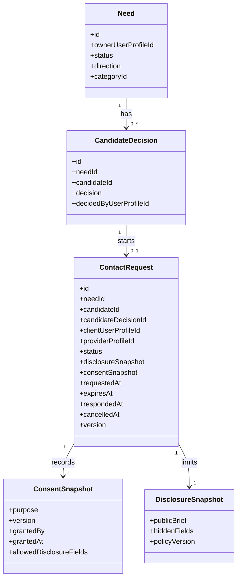

# SRS: Core P1 ContactRequest and Consent Baseline

Дата: 2026-06-26
Версия: 0.1
Статус: draft for implementation
Sprint: 2026-07-06 - 2026-07-17

## 1. Назначение

SRS определяет первый post-match increment CIFEDRA Core:

```text
Client Decision
  -> ContactRequest
  -> Consent / permitted disclosure
  -> Provider acceptance or decline
  -> Engagement candidate
```

Главная граница: `requested_contact` является намерением клиента запросить
контакт с выбранным кандидатом. Это не раскрывает контакты, не означает
согласие исполнителя и не создает `Engagement`.

## 2. Scope

### In scope

- `ContactRequest` aggregate and lifecycle;
- actors, permissions and transition rules;
- связь с `Need`, selected candidate and client decision;
- consent and disclosure baseline before contact reveal;
- provisional rule for combined Life requests;
- idempotency, optimistic version and domain-event readiness;
- acceptance scenarios for Core, PostgreSQL and API implementation.

### Out of scope

- real direct chat between client and provider;
- payment, payout, escrow and invoicing;
- legal terms, production privacy policy and consent text approval;
- provider verification and trust scoring;
- booking calendar and full `Engagement` lifecycle;
- real user data, exact address, confidential files and external links;
- automatic split execution for combined Life requests.

## 3. Product assumptions requiring confirmation

| ID | Assumption | Recommended baseline |
| --- | --- | --- |
| PA-CR-001 | Provider response timeout | Local implementation supports explicit `expiresAt`; automatic expiry worker can be added later. Product default proposed: 48 hours. |
| PA-CR-002 | Life combined request | If one provider/visit can satisfy selected variants, use one Need and one ContactRequest. If not, ask the client before creating linked Needs. No automatic split. |
| PA-CR-003 | Pre-accept disclosure | Show only category, service variants, region, expected result, language and preferred time. Hide exact address, contact details, confidential files and external links. |
| PA-CR-004 | Work result format | Start with structured Markdown findings; DOCX/PDF export remains a later artifact increment. |
| PA-CR-005 | First communication | Concierge flow through CIFEDRA/Chatwoot adapter after permitted disclosure; direct chat remains later. |

These assumptions allow implementation to start locally. They must be reviewed
before external pilot or production rollout.

## 4. Actors

| Actor | Description |
| --- | --- |
| Client | Owner of the Need and the only actor who can request or cancel contact for that Need. |
| Provider | Owner of the selected ProviderProfile and the only actor who can accept or decline the request. |
| Operator | Can assist analysis and view permitted support context, but cannot request, accept or disclose contact on behalf of participants. |
| Administrator | Can inspect operational state according to policy; administrative override is out of P1 implementation. |
| System | Performs validation, expiry and domain-event creation. |

## 5. Domain model



## 6. Lifecycle

```text
draft -> requested -> accepted
                   -> declined
                   -> expired
                   -> cancelled
```

`draft` is internal construction state and shall not be persisted as an active
request. First externally visible state is `requested`.

### Status semantics

| Status | Meaning | Terminal |
| --- | --- | --- |
| `requested` | Client asked selected provider to consider contact. Contact details remain hidden. | no |
| `accepted` | Provider accepted the request. Core may create an Engagement candidate and permit next disclosure according to consent policy. | yes |
| `declined` | Provider declined. Client may choose another candidate or keep the Need open. | yes |
| `expired` | Request was not answered before `expiresAt`. | yes |
| `cancelled` | Client cancelled before provider accepted. | yes |

Terminal requests are immutable in P1. Any administrative reopening requires a
separate future requirement.

## 7. Functional requirements

### Creation

| ID | Requirement |
| --- | --- |
| CRQ-001 | Core shall create ContactRequest only for an existing Need in `ready_for_match` or later matchable status. |
| CRQ-002 | Core shall require an existing selected candidate for the Need. |
| CRQ-003 | Core shall require a `CandidateDecision` with decision `requested_contact`. |
| CRQ-004 | The requester shall be the owner of the Need. |
| CRQ-005 | One ContactRequest shall reference exactly one candidate/provider profile. |
| CRQ-006 | Repeated create command with the same idempotency key shall return the same ContactRequest result. |
| CRQ-007 | Core shall reject duplicate active ContactRequest for the same Need and provider. |
| CRQ-008 | ContactRequest creation shall store `disclosureSnapshot` and `consentSnapshot` used for the provider-facing brief. |
| CRQ-009 | ContactRequest creation shall not disclose client contact details, exact address, files or external links. |
| CRQ-010 | ContactRequest creation shall not create `Engagement`. |

### Provider response

| ID | Requirement |
| --- | --- |
| CRQ-011 | Only the selected provider owner may accept or decline the request. |
| CRQ-012 | Provider acceptance changes status from `requested` to `accepted`. |
| CRQ-013 | Provider decline changes status from `requested` to `declined` and may require a reason code. |
| CRQ-014 | Provider response to terminal request shall be rejected with a domain conflict. |
| CRQ-015 | Provider acceptance shall be the earliest point where Core may create an Engagement candidate. |
| CRQ-016 | Provider acceptance shall not by itself publish phone, email or exact address unless the consent/disclosure policy allows it. |

### Cancellation and expiry

| ID | Requirement |
| --- | --- |
| CRQ-017 | Client may cancel only own `requested` ContactRequest. |
| CRQ-018 | System may expire only `requested` ContactRequest with `expiresAt <= now`. |
| CRQ-019 | Expiry shall be deterministic and idempotent. |
| CRQ-020 | Cancellation after provider acceptance shall be rejected; later cancellation belongs to Engagement lifecycle. |

### Authorization and audit readiness

| ID | Requirement |
| --- | --- |
| CRQ-021 | Commands shall receive trusted actor context from auth/application boundary, not actor ids from request body. |
| CRQ-022 | Operator shall not request, accept, decline or cancel ContactRequest on behalf of client/provider in P1. |
| CRQ-023 | Every command shall be auditable with actor, action, resource id, timestamp, correlation id and optional reason. |
| CRQ-024 | Repository save shall use optimistic version to reject lost updates. |
| CRQ-025 | Domain transaction shall be ready to emit ContactRequest domain events through outbox in a later step. |

## 8. Consent and disclosure baseline

### Pre-accept permitted disclosure

Provider-facing brief before acceptance may include:

- direction and category;
- service variant, for example `pool_cleaning` or `lawn_mowing`;
- approximate region or service area, not exact address;
- expected result and short sanitized description;
- preferred language and communication language;
- preferred time window or urgency;
- synthetic artifact metadata for local Work fixtures.

### Pre-accept prohibited disclosure

Provider-facing brief before acceptance shall not include:

- phone, email, messenger handle or personal social links;
- exact home address, apartment, floor, access code or geolocation;
- confidential SRS text, customer files, URLs to private documents or images;
- payment card, bank, identity document or tax data;
- personal data of third parties not represented by the actor.

### Consent requirements

| ID | Requirement |
| --- | --- |
| CNS-001 | Core shall keep original submitted data separate from sanitized disclosure snapshot. |
| CNS-002 | Core shall store policy version used to produce disclosure snapshot. |
| CNS-003 | Contact details remain hidden until both client requested contact and provider accepted the request. |
| CNS-004 | Exact address remains hidden until the execution scenario explicitly requires it and consent policy allows it. |
| CNS-005 | Machine translation shall not replace original text in consent or disclosure records. |
| CNS-006 | Operator support view shall use the same or stricter disclosure policy than provider pre-accept view. |
| CNS-007 | Revocation after accepted ContactRequest shall be handled by future Engagement/Conversation policy and is out of P1 implementation. |

## 9. Life combined request rule

Life pilot category is `Уход за участком`; pool cleaning and lawn mowing are
service variants.

Rule for ContactRequest:

1. If the client expects one visit/provider and candidate supports all selected
   variants, create one ContactRequest.
2. If no candidate supports all variants, do not auto-split.
3. Ask the client whether to split into linked Needs or narrow scope.
4. Linked Needs must preserve correlation to the original combined request.

This rule is provisional until product owner confirms `OPEN-007`.

## 10. API and persistence readiness

P1 implementation shall be compatible with later public API contracts:

- `POST /v1/contact-requests`;
- `POST /v1/contact-requests/{id}/accept`;
- `POST /v1/contact-requests/{id}/decline`;
- `POST /v1/contact-requests/{id}/cancel`;
- `POST /v1/contact-requests/expire-due` for local worker/manual test.

DTOs shall use safe error envelopes and shall not accept privileged actor fields
from request body.

PostgreSQL implementation shall store:

- aggregate ids and references;
- status and timestamps;
- consent/disclosure snapshots as versioned JSON;
- idempotency key;
- optimistic version;
- created/updated timestamps.

Runtime DB role must not require DDL privileges.

## 11. Acceptance scenarios

| ID | Scenario | Expected result |
| --- | --- | --- |
| AC-CRQ-001 | Client creates request from own `requested_contact` decision. | ContactRequest is `requested`; disclosure snapshot excludes contacts/address. |
| AC-CRQ-002 | Different client tries to create request for another user's Need. | Command rejected as forbidden. |
| AC-CRQ-003 | Provider accepts own pending request. | Status becomes `accepted`; Engagement candidate can be created later. |
| AC-CRQ-004 | Unrelated provider accepts request. | Command rejected as forbidden. |
| AC-CRQ-005 | Provider declines pending request. | Status becomes `declined`; request is terminal. |
| AC-CRQ-006 | Client cancels pending request. | Status becomes `cancelled`; provider can no longer accept. |
| AC-CRQ-007 | System expires due request. | Status becomes `expired`; repeated expiry returns same terminal result. |
| AC-CRQ-008 | Duplicate active request is submitted. | Command rejected or idempotently returns existing request when idempotency key matches. |
| AC-CRQ-009 | Work fixture contains artifact metadata. | Provider pre-accept brief shows metadata only, not file content or external links. |
| AC-CRQ-010 | Skills fixture contains interview topic. | Provider sees topic and language, not client contact details. |
| AC-CRQ-011 | Life combined service has no all-variant candidate. | Core returns split-required decision point; does not create two requests automatically. |

## 12. Traceability

| Source | Requirement link |
| --- | --- |
| `DEC-020` | Contacts hidden until mutual match; operator does not choose or disclose. |
| `DEC-024` | Next sprint starts with ContactRequest/Consent/Engagement. |
| `OPEN-007` | Combined Life splitting rule. |
| `R-019` | Life pilot must not reveal real home-service data before trust/safety. |
| `core-cjm-gap-analysis.md` | `requested_contact` is not provider acceptance. |
| `cifedra-hld.md` | Contact Request component and primary post-match sequence. |

## 13. Open decisions

| ID | Question | Required before |
| --- | --- | --- |
| OD-CR-001 | Confirm provider response timeout default: 48 hours or manual-only local pilot. | API/OpenAPI default. |
| OD-CR-002 | Confirm Life split UX: ask client first vs automatic linked Needs. | Core split command implementation. |
| OD-CR-003 | Confirm exact pre-accept provider fields for each direction. | External pilot. |
| OD-CR-004 | Confirm post-accept contact/address disclosure text and legal consent version. | Production/beta. |

## 14. Implementation order

1. Add Core `ContactRequest` domain module and unit tests.
2. Connect `requested_contact` decision to ContactRequest creation.
3. Add consent/disclosure snapshot builder and negative tests.
4. Extend local Life/Work/Skills vertical flows.
5. Add PostgreSQL migration/repository slice.
6. Add API application service and draft OpenAPI.
7. Add Engagement baseline after accepted ContactRequest.
