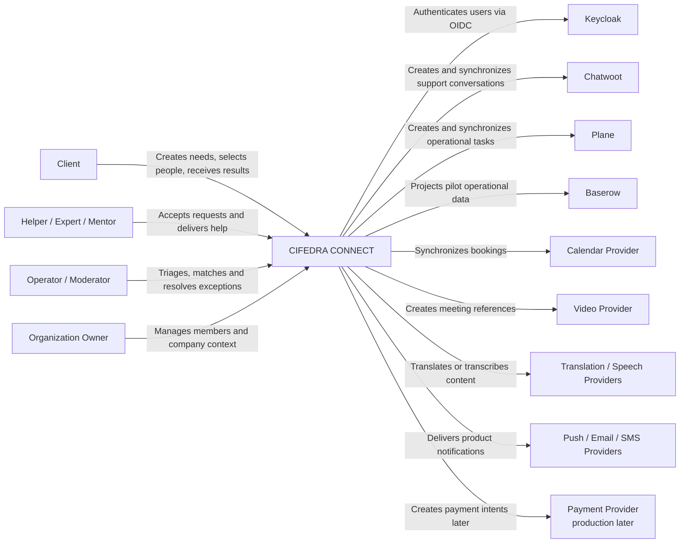
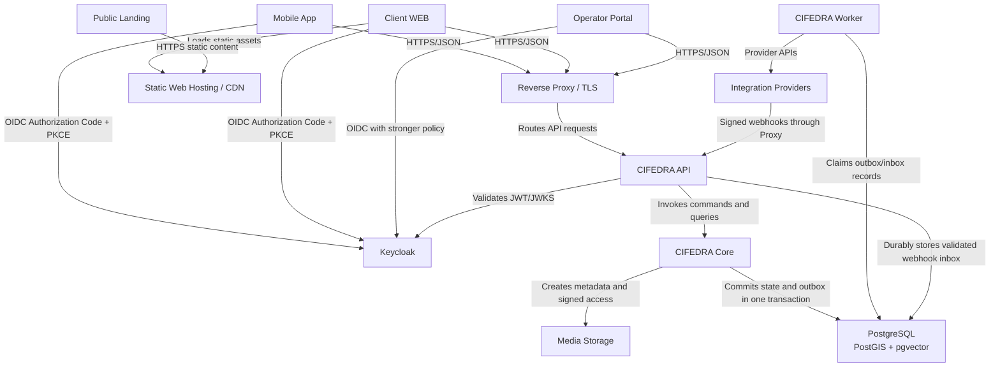
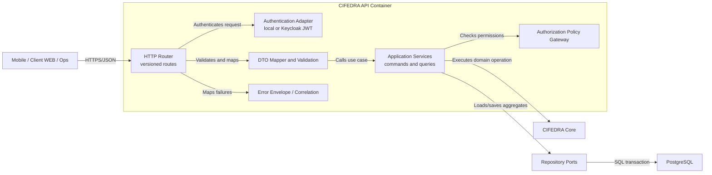
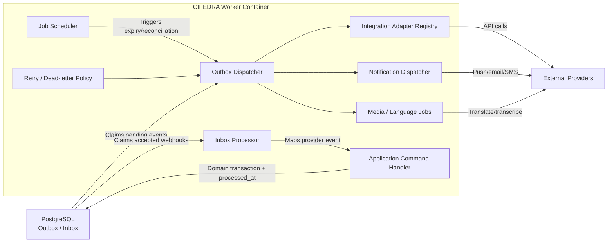
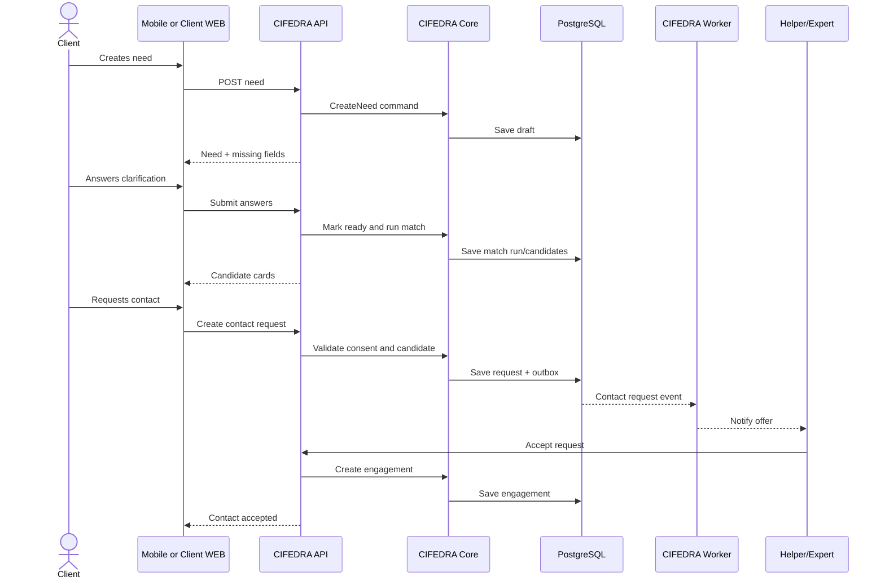
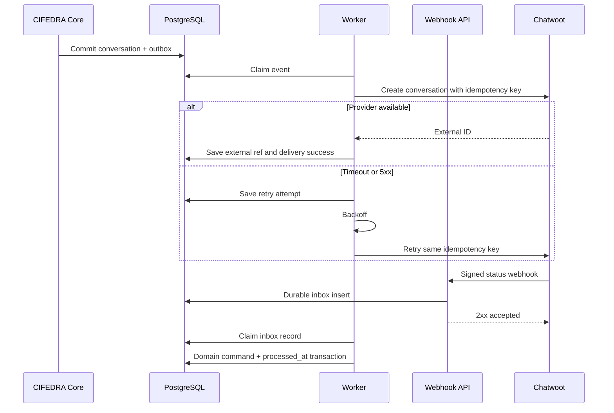
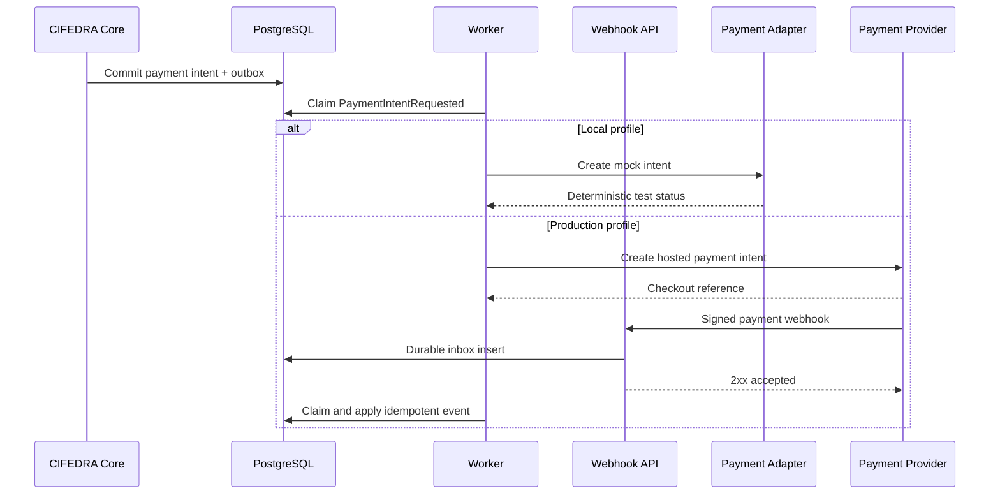
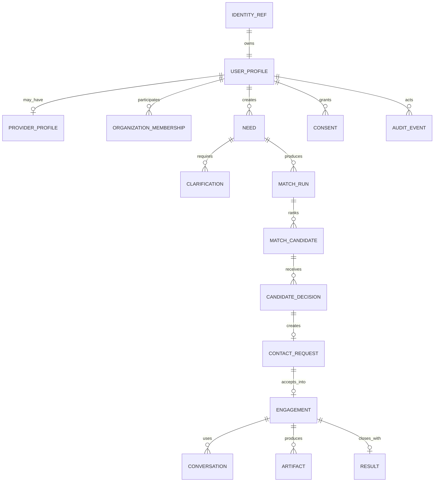
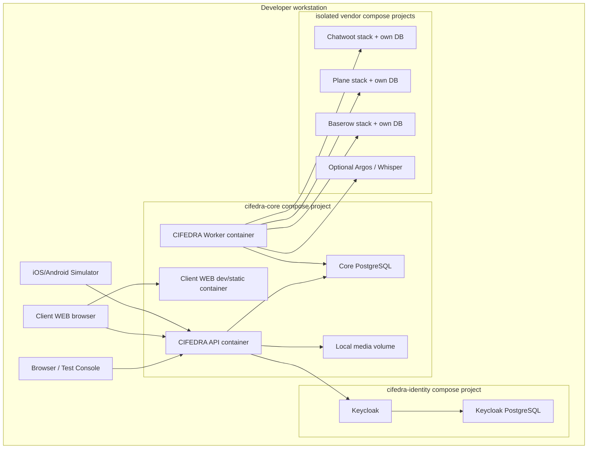
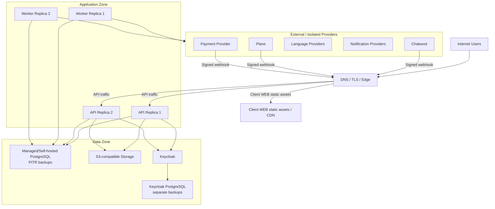

# CIFEDRA CONNECT: High-Level Design

Дата: 2026-06-20
Версия: HLD v0.6
Статус: approved architecture baseline; sizing and detailed SRS remain open

## 1. Назначение

HLD описывает целевую высокоуровневую архитектуру `CIFEDRA CONNECT` для
направлений `Life`, `Work`, `Skills`.

Документ определяет:

- границы продукта;
- основные контейнеры и компоненты;
- владельцев данных;
- интеграции;
- local, staging and production topology;
- security and reliability principles;
- последовательность реализации.

Связанные документы:

- [Целевая архитектура](./cifedra-target-architecture.md).
- [Аудит CJM и Core](./core-cjm-gap-analysis.md).
- [CJM по направлениям](../product/cjm-scenarios-gap-analysis.md).
- [CJM по ролям](../product/cjm-by-roles.md).
- [План авторизации](./auth-integration-plan.md).
- [Языки и голос](./multilingual-voice-plan.md).
- [План клиентского WEB](./web-client-build-plan.md).
- [Architecture Decision Records](../adr/README.md).

Метод представления: C4 Model на уровнях System Context, Container и
Component, дополненный Dynamic и Deployment diagrams. Code-level diagrams,
классы, таблицы БД и алгоритмы относятся к LLD.

## 2. Цели решения

1. Дать пользователю единый flow поиска полезного человека:

```text
Need
  -> Clarify
  -> Match
  -> Decide
  -> Request Contact
  -> Accept
  -> Connect
  -> Execute
  -> Result
```

2. Поддерживать разные правила `Life`, `Work`, `Skills` без создания трех
   независимых систем.
3. Собирать mobile-first и web-accessible продукт, не зависящий от UI Plane,
   Chatwoot, Baserow, Calendly или других внешних систем.
4. Позволять локальную разработку и тестирование до внешнего deployment.
5. Подключать production providers через заменяемые adapters.
6. Сохранять продуктовые данные и lifecycle в CIFEDRA.

## 3. Functional Requirements

### 3.1 Клиент

Клиент может:

1. Зарегистрироваться и заполнить профиль.
2. Выбрать направление `Life`, `Work` или `Skills`.
3. Создать, изменить или отменить Need.
4. Ответить на уточняющие вопросы.
5. Получить объяснимый список кандидатов.
6. Сохранить, отклонить или выбрать кандидата.
7. Запросить контакт.
8. Получить подтверждение или отказ помощника.
9. Передать разрешенный контекст и начать коммуникацию.
10. Отслеживать задачу, поручение или встречу.
11. Подтвердить результат, приложить proof и оставить feedback.

### 3.2 Помощник / эксперт / ментор

Исполнитель может:

1. Создать provider profile и указать специализацию.
2. Задать availability, географию, timezone, языки и форматы.
3. Пройти необходимую verification.
4. Получить безопасный preview запроса.
5. Принять, отклонить или запросить уточнение.
6. Общаться и выполнять engagement.
7. Передать результат и получить feedback.

### 3.3 Оператор / администратор

Оператор может:

1. Обрабатывать queue и SLA.
2. Выполнять triage и ручной matching.
3. Создавать Chatwoot conversation и Plane task.
4. Обрабатывать escalation, report и moderation case.
5. Закрывать outcome с причиной и audit trail.

Администратор может управлять:

- roles and permissions;
- verification and moderation;
- catalog and intake schemas;
- integrations and health;
- audit and retention policies.

### 3.4 Functional traceability

Детальная трассировка шагов и gaps:

- [CJM по направлениям](../product/cjm-scenarios-gap-analysis.md);
- [CJM по ролям](../product/cjm-by-roles.md);
- [Core gap analysis](./core-cjm-gap-analysis.md).

## 4. Non-Functional Requirements summary

| Requirement | HLD response |
| --- | --- |
| Availability | Stateless API/worker, retries and production redundancy. |
| Responsiveness | Synchronous path содержит только Core transaction; integrations асинхронны. |
| Reliability | PostgreSQL transaction, outbox/inbox, idempotency and reconciliation. |
| Security | OIDC, least privilege, consent, audit and data minimization. |
| Maintainability | Modular monolith, ports/adapters and versioned contracts. |
| Scalability | Horizontal API/worker scaling after measurement. |
| Internationalization | Locale, timezone, language metadata and provider adapters. |
| Testability | Local mocks, contract tests, smoke and E2E. |
| Recoverability | Backups, restore tests and explicit RTO/RPO before staging acceptance. |

Quantitative SLO values remain TBD until pilot sizing is approved.

## 5. Domain classification

Разделение Core/Supporting/Generic помогает не превращать внешние платформы в
владельцев продуктовой логики.

### 5.1 Core domains

Именно эти зоны формируют основную ценность CIFEDRA:

| Domain | Why Core |
| --- | --- |
| Need Intake and Clarification | Формализует реальную потребность пользователя. |
| Provider Profile and Availability | Определяет, кого и при каких условиях можно подобрать. |
| Matching and Explanation | Основной механизм поиска полезного человека. |
| Decision and Contact Request | Управляет выбором и двухсторонним согласием. |
| Trust and Consent | Делает контакт безопасным и управляемым. |
| Engagement | Связывает контакт с реальным выполнением. |
| Result and Quality Loop | Проверяет ценность подбора и улучшает правила. |

### 5.2 Supporting domains

| Domain | Role |
| --- | --- |
| Organization and Membership | Поддерживает Work/company scenarios. |
| Booking and Scheduling | Поддерживает Skills, Work and Care engagements. |
| Conversation Coordination | Связывает product state с каналами связи. |
| Operator Operations | Queue, triage, SLA and manual override. |
| Catalog and Intake Schema Management | Управляет направлениями и версиями форм. |
| Artifacts and Knowledge References | Хранит метаданные SRS, CV, proof and materials. |

### 5.3 Generic capabilities

Эти возможности интегрируются или переиспользуют стандартные решения:

| Capability | Target solution |
| --- | --- |
| Authentication | Keycloak. |
| Notifications | Push/email/SMS providers. |
| Object storage | S3-compatible storage. |
| Text translation | Provider adapter; Argos local candidate. |
| Speech transcription | Provider adapter; Whisper candidate. |
| Video | Jitsi or another provider. |
| Payments | PSP adapter; mock locally. |
| Observability | Standard logs, metrics and traces. |

## 6. Не входит в текущий scope

- production payment provider;
- payouts и marketplace settlement;
- direct user-to-helper messenger;
- live speech-to-speech translation;
- production video infrastructure;
- ML-обучение matching;
- multi-region deployment;
- отдельные микросервисы для каждого домена.

Эти зоны должны иметь контракты или extension points, но не реализуются до
подтверждения основного сценария.

## 7. Архитектурные драйверы

| Драйвер | Архитектурное следствие |
| --- | --- |
| Mobile + client WEB | Versioned API, OIDC, responsive UX, push/in-app notifications. |
| Self-host / modifiable | Open standards и open-source предпочтительнее SaaS lock-in. |
| Три направления | Общий lifecycle + direction-specific schemas and policies. |
| Ручной пилот | Baserow/Chatwoot/Plane доступны через adapters. |
| Privacy | Consent, disclosure policy, audit and data minimization. |
| Reliability | Transactional outbox, idempotent webhooks, external refs. |
| International use | Locale, timezone, languages, translation metadata. |
| Локальная разработка | Mock providers and Docker-based integrations. |
| Future commerce | Payment abstraction без хранения card data. |

## 8. Ограничения и sizing assumptions

На текущем локальном этапе продуктовые объемы еще не подтверждены. HLD не
фиксирует вымышленные значения нагрузки. Перед staging необходимо утвердить:

| Параметр | Статус |
| --- | --- |
| MAU/DAU по направлениям | TBD по pilot plan. |
| Peak API requests per second | TBD по load profile. |
| Количество активных профилей | TBD. |
| Среднее число кандидатов на Need | TBD после пилота matching. |
| Объем файлов и аудио в месяц | TBD после voice/artifact scope. |
| Доля запросов с переводом | TBD по выбранным языкам. |
| Notification volume | TBD по CJM events. |
| Payment transactions | Не применимо до commercial pilot. |
| Required API availability | Определить до staging. |
| RTO/RPO | Определить до staging acceptance. |

До появления данных применяем следующие ограничения:

- один регион deployment;
- один primary PostgreSQL;
- без database sharding;
- без Kafka/RabbitMQ;
- горизонтально масштабируемые stateless API/worker только при необходимости;
- внешние integrations считаются ненадежными и обрабатываются асинхронно;
- media не передается через Core как долгоживущий binary payload.

## 9. C4 notation

### 9.1 Уровни

| Уровень | Что показывает | Раздел HLD |
| --- | --- | --- |
| C4 Level 1 | Пользователи, CIFEDRA и внешние software systems. | System Context. |
| C4 Level 2 | Deployable/runnable containers и data stores. | Container Architecture. |
| C4 Level 3 | Компоненты внутри API и Worker. | Component Architecture. |
| C4 Level 4 | Классы, функции, DB schemas. | Не входит; оформляется в LLD. |

### 9.2 Легенда

| Элемент | Значение |
| --- | --- |
| Person | Пользователь или операционная роль. |
| Software System | CIFEDRA или внешняя система. |
| Container | Отдельно запускаемое приложение, worker или data store. |
| Component | Логически связанный набор функций внутри container. |
| Solid relationship | Синхронный вызов или основная зависимость. |
| Async relationship | Event/outbox/webhook processing. |
| External | Заменяемый provider за adapter boundary. |

Каждая диаграмма должна иметь:

- название и scope;
- понятные имена элементов;
- назначение и технологию, где это важно;
- подписанные отношения;
- отсутствие деталей, принадлежащих следующему уровню.

## 10. C4 Level 1: System Context



### 10.1 Context boundary

В границы CIFEDRA входят product lifecycle, data ownership, policies,
matching, contact acceptance, execution and result. Keycloak, Chatwoot, Plane,
Baserow, calendar, language and payment providers являются внешними systems.

## 11. C4 Level 2: Container Architecture

### 11.1 Контейнеры

| Контейнер | Ответственность | Технология / статус |
| --- | --- | --- |
| Mobile App | Клиентский и provider flow. | React Native + Expo, planned. |
| Client WEB | Тот же клиентский/provider flow в browser. | React + TypeScript + Vite, planned. |
| Web Landing | Информация и store links. | Static web, implemented. |
| Operator/Admin Portal | Queue, triage, moderation, catalog. | Custom web, planned. |
| CIFEDRA API | Public API, auth validation, DTO, policies. | Node.js/TypeScript, prototype. |
| CIFEDRA Core | Domain model and business rules. | TypeScript package, active. |
| CIFEDRA Worker | Outbox, notifications, adapters, retries. | Node.js/TypeScript, planned. |
| PostgreSQL | Product source of truth. | Planned. |
| Media Storage | Files, audio, artifacts. | Local filesystem dev; S3-compatible prod. |
| Keycloak | Authentication and IdP sessions. | Planned after identity boundary. |
| Integration Runtime | Chatwoot, Plane, Baserow and optional providers. | Docker/local and isolated prod. |
| Observability | Logs, metrics, traces and alerts. | Basic logs now; production stack later. |

### 11.2 Container diagram



## 12. C4 Level 3: Component Architecture

На MVP используем modular monolith + worker, а не набор микросервисов.

```text
apps/api
  -> packages/core
  -> repositories
  -> outbox

apps/worker
  -> outbox dispatcher
  -> notification adapters
  -> integration adapters
  -> media/language jobs
```

### 12.1 API container components



Responsibilities:

| Component | Responsibility |
| --- | --- |
| HTTP Router | Versioned endpoints, HTTP method/path routing. |
| Authentication Adapter | Validate local token or Keycloak JWT. |
| DTO Mapper/Validation | Separate public contracts from domain types. |
| Authorization Policy Gateway | Ownership, membership, consent and role checks. |
| Application Services | Transaction boundary and use-case orchestration. |
| Error/Correlation | Stable error envelope and trace correlation. |

### 12.2 Worker container components



Signed provider webhooks входят через публичный API ingress. API проверяет
signature/replay, сохраняет inbox record и быстро отвечает provider. Worker не
публикуется в Internet и не изменяет domain tables в обход application
services.

### 12.3 Core components

| Module | Responsibility |
| --- | --- |
| Identity Boundary | Normalize `issuer + subject` into principal. |
| Authorization | Ownership, permissions and organization scope. |
| Profile | User/provider profile, preferences, languages, visibility. |
| Catalog | Directions, categories and versioned intake schemas. |
| Need Intake | Draft, answers, completeness and clarification. |
| Matching | Match run, direction rules, explanation and version. |
| Decision | Candidate decision and shortlist. |
| Contact Request | Request, accept, decline, expiry and cancellation. |
| Consent | Disclosure permission and revocation. |
| Conversation | Channel, participants and state. |
| Engagement | Assignment, booking/task/session and execution status. |
| Trust & Safety | Verification, report, block, risk and moderation. |
| Result | Outcome, artifacts, proof, review and quality signal. |
| Notification | Notification intent and preference. |
| Language | Locale, requirements, translation/transcript metadata. |
| Organization | Tenant, membership, invitation and company access. |
| Commerce | Money, terms and payment provider references. |
| Audit | Actor, action, resource, reason and timestamp. |
| Events | Domain event, correlation, causation and idempotency. |

### 12.4 Component ownership rules

1. API components do not implement domain rules.
2. Core does not import provider SDKs.
3. Worker does not bypass application/domain policies.
4. Repositories implement ports defined by the application/Core boundary.
5. External webhooks become validated commands, not direct DB updates.
6. Public DTO changes are versioned independently from internal refactoring.

## 13. Dynamic diagrams

### 13.1 Primary user flow



### 13.2 External integration and retry



### 13.3 Payment flow in local and production



## 14. Data Architecture

### 14.1 Storage selection by access pattern

PostgreSQL 18 является единственным source of truth для product state.
Текущая утвержденная база: PostgreSQL 18.4, PostGIS 3.6.4 и pgvector 0.8.3.
Подробности зафиксированы в
[ADR-002](../adr/ADR-002-postgresql-core-data-platform.md).

Extensions:

- PostGIS for Life geography;
- pgvector for semantic candidate retrieval;
- PostgreSQL full-text search for initial search;
- outbox/inbox tables for integration reliability.

| Data/access pattern | Storage decision | Rationale |
| --- | --- | --- |
| Profiles, Needs, lifecycle and permissions | PostgreSQL relational tables. | Transactions, constraints and joins. |
| Life distance and service area | PostGIS. | Geospatial indexes and queries. |
| Semantic candidate retrieval | pgvector initially. | Vectors live near profile/need data. |
| Files, audio, video and result artifacts | S3-compatible object storage. | Large binary data should not live in relational rows. |
| Media/artifact metadata | PostgreSQL. | Ownership, consent and access policy. |
| Domain events | PostgreSQL outbox/inbox. | Atomic state and event persistence. |
| Search | PostgreSQL FTS initially. | Avoid separate search runtime before scale requires it. |
| Cache | None by default. | Add Redis only after measured hot reads/latency. |
| Analytics | PostgreSQL projections initially. | Separate warehouse only after reporting volume grows. |

### 14.2 Database boundaries

| Database/system | Boundary |
| --- | --- |
| `cifedra_core` | Dedicated Core PostgreSQL instance, database and roles. |
| Keycloak DB | Separate PostgreSQL instance/database; credentials and sessions only. |
| Chatwoot/Plane/Baserow DB | Vendor-owned isolated databases, never queried by CIFEDRA. |
| Object storage | Binary data; Core owns metadata, checksum, retention and access policy. |

Core schemas follow module ownership: `identity`, `people`, `need`, `matching`,
`engagement`, `communication`, `trust`, `catalog`, `commerce`, `integration`
and `audit`. `Life`, `Work`, `Skills` use common tables with direction-specific
intake definitions and policies; they do not receive separate PostgreSQL
schemas or databases.

### 14.3 High-level entity groups



### 14.4 Data consistency

| Data | Consistency model |
| --- | --- |
| Core aggregate transaction | Strong consistency in one PostgreSQL transaction. |
| Match result persisted with rule version | Strong consistency. |
| External Chatwoot/Plane/calendar projection | Eventual consistency. |
| Notifications | At-least-once intent, provider delivery deduplicated where possible. |
| Webhooks | At-least-once input with inbox deduplication. |
| Search/vector indexes | Eventual consistency and rebuildable. |
| Analytics/reporting | Eventual consistency. |

### 14.5 Read/write paths

На первом этапе API и Core используют единый transactional model.

```text
Write:
Client -> API -> Application Service -> Core -> PostgreSQL transaction
                                  \-> Outbox

Read:
Client -> API -> Query Service -> PostgreSQL
```

Отдельные Read Service, Write Service, Redis cache или CQRS projections
добавляются только при подтвержденной проблеме:

- разные read/write scaling profiles;
- тяжелые агрегированные карточки;
- недопустимая latency PostgreSQL query;
- необходимость independently rebuildable projections.

### 14.6 Tenant isolation

- shared-table tenancy with `owner_user_id` and/or `organization_id`;
- application authorization and scoped constraints are mandatory;
- no schema-per-tenant;
- PostgreSQL RLS is added as defense in depth before Work organization pilot.

### 14.7 Media

PostgreSQL хранит metadata и access policy. Binary content хранится отдельно.

Local:

```text
.local/media/
```

Production:

```text
S3-compatible object storage
```

## 15. Identity and Security

### 15.1 Authentication

- Keycloak is production/staging IdP.
- Mobile uses Authorization Code through external browser + PKCE.
- Client WEB uses Authorization Code + PKCE and stores tokens only in memory.
- API validates issuer, audience, signature and expiration.
- Local auth remains test adapter.

### 15.2 Authorization

Keycloak roles не заменяют Core policies.

Core проверяет:

- owner of Need/Profile/Artifact;
- organization membership;
- operator/moderator scope;
- consent and data disclosure;
- risk category policy;
- resource visibility.

### 15.3 Sensitive data

- exact address скрыт до разрешенного шага;
- cards/payment credentials не хранятся;
- external provider tokens хранятся только в secrets storage;
- audio and transcripts have retention policy;
- administrative override is audited;
- account and data deletion flow обязателен до production.

## 16. Integration Architecture

Все интеграции реализуются через ports/adapters.

Утвержденный стандарт:
[ADR-003](../adr/ADR-003-interservice-communication-standard.md).

```text
Core Domain Event
  -> Transactional Outbox
  -> Worker
  -> Provider Adapter
  -> External Service
  -> API Webhook Ingress
  -> Inbox Deduplication
  -> Worker
  -> Domain Command
```

### 16.1 Interaction rules

| Interaction | Standard |
| --- | --- |
| Client API | REST/JSON over HTTPS, OpenAPI 3.1, `/api/v1`. |
| Errors | RFC 9457 `application/problem+json`. |
| Concurrency | `ETag/If-Match` or explicit `expectedVersion`. |
| Command retries | `Idempotency-Key` for create/external-side-effect commands. |
| Internal Core calls | In-process application services, not HTTP. |
| Async delivery | PostgreSQL transactional outbox, at-least-once. |
| Events | CloudEvents 1.0 envelope + versioned JSON Schema. |
| Webhooks | API ingress -> durable inbox -> asynchronous idempotent command. |
| External state drift | Scheduled reconciliation jobs. |

### 16.2 Integration matrix

| Integration | Purpose | Source of truth | Local mode | Production decision |
| --- | --- | --- | --- | --- |
| Chatwoot | Support/concierge. | Chatwoot for messages; Core for product state. | Live local container. | Keep behind adapter. |
| Plane | Operational tasks. | Plane task + Core engagement projection. | Draft/local container. | Keep internal. |
| Baserow | Pilot backoffice. | Never product source of truth. | Planned local. | Remove or retain as projection. |
| Calendly | SaaS scheduling integration. | Core Booking. | Not required. | Optional adapter. |
| Cal.diy | Self-host scheduling spike. | Core Booking. | Optional experiment only. | Not recommended as prod dependency. |
| Jitsi | Video meeting. | Core Booking/Conversation. | Deferred. | Optional adapter. |
| Argos Translate | Offline text translation. | Core original + translation record. | Candidate for local spike. | Compare quality. |
| Whisper | Speech transcription/language detection. | Core media/transcript metadata. | Candidate for local spike. | Replaceable provider. |
| n8n | Internal automation. | Never product source of truth. | Not needed for MVP. | Optional after event contracts. |
| Payment Provider | Payment processing. | PSP record + Core projection. | Mock only. | Real provider before commercial production. |

## 17. Scheduling

Core owns:

- availability;
- slots;
- timezone;
- booking;
- confirmation;
- reschedule;
- cancellation;
- no-show;
- meeting external reference.

Calendly or another provider is an adapter. A booking link alone does not
replace Core Booking because CIFEDRA needs status, result and quality loop.

## 18. Languages and Voice

```text
Audio
  -> Media Storage
  -> SpeechTranscriptionProvider
  -> Transcript
  -> optional TextTranslationProvider
  -> user review
```

Whisper:

- transcription;
- language identification;
- audio-to-English translation.

Argos Translate:

- offline text translation candidate;
- arbitrary supported language pairs;
- local quality must be measured.

UI localization remains a separate resource-based i18n process.

## 19. Automation and n8n

n8n is not required for Core or client applications MVP.

Allowed target use:

- internal reports;
- CRM/backoffice sync;
- non-critical notifications;
- manual operations;
- support automations.

Prohibited as source of truth:

- matching;
- lifecycle transitions;
- permissions;
- consent;
- moderation;
- payment state;
- audit.

Default implementation: custom workers consuming domain events.

## 20. Payments

### 20.1 Local

- `MockPaymentProvider`;
- test money only;
- deterministic webhook fixtures;
- no card data and no PSP secrets.

### 20.2 Production

Payment provider selection is deferred until:

- legal entity and jurisdiction are known;
- supported countries/currencies are known;
- marketplace vs direct payment model is approved;
- commissions, payouts, taxes, refunds and disputes are specified.

Integration requirements:

- hosted checkout/tokenization;
- signed webhooks;
- idempotency;
- reconciliation;
- refund/dispute states;
- PCI scope minimization.

## 21. C4 Deployment Architecture

### 21.1 Current local

| Component | Status |
| --- | --- |
| Core/API | Running locally. |
| Landing/Test Console | Running locally. |
| Local Auth | Running locally. |
| Chatwoot | Installed and tested. |
| Plane | Installed/draft integration. |
| PostgreSQL Core | Not yet added. |
| Keycloak | Not yet added. |
| Baserow | Planned. |

### 21.2 Target local

```text
CIFEDRA managed local environment
  cifedra-core compose project
    - cifedra-api
    - cifedra-worker
    - cifedra-postgres
    - cifedra-web
  cifedra-identity compose project/profile
    - keycloak
    - keycloak-postgres
  vendor compose projects/profiles
    - chatwoot + own dependencies/data
    - plane + own dependencies/data
    - baserow + own dependencies/data
  optional profiles
    - argos/whisper
    - observability

Mocks
  - notifications
  - calendar
  - payments
  - object storage via local filesystem
```

Компоненты включаются профилями `core`, `identity`, `support`, `tasks`,
`backoffice`, `language`, `observability`. Единые project scripts управляют
окружением, но vendor stacks сохраняют отдельные compose projects, networks,
volumes and upgrade cycles. Количество контейнеров не означает
microservice-архитектуру CIFEDRA.

К shared network подключаются только API-facing containers/proxies. Vendor
PostgreSQL, Redis/Valkey, RabbitMQ и object storage остаются в private networks
соответствующих compose projects и не публикуются на host.

### 21.3 Local deployment diagram



### 21.4 Staging

- production-like Keycloak/PostgreSQL;
- test domains and TLS;
- sandbox notification/calendar/payment providers;
- isolated test data;
- migrations and backup validation;
- TestFlight/Google Play internal builds.

### 21.5 Production

- reverse proxy/load balancer and TLS;
- stateless API replicas;
- worker replicas;
- PostgreSQL backups and point-in-time recovery;
- object storage versioning/backup and metadata reconciliation;
- Keycloak backup and key rotation;
- secrets management;
- metrics/logs/traces/alerts;
- signed provider webhooks;
- real payment provider;
- privacy, terms and deletion endpoints.

### 21.6 Production deployment diagram



## 22. Scalability and resilience

### 22.1 Scaling path

1. Optimize PostgreSQL queries and indexes.
2. Scale stateless API horizontally.
3. Scale workers by queue/event type.
4. Add read replicas only after measured read pressure.
5. Add Meilisearch/Qdrant only after measured search/vector limits.
6. Partition high-volume audit/event tables only after evidence.
7. Split a module into a service only when ownership or scaling requires it.

### 22.2 Failure policy

| Failure | Expected behavior |
| --- | --- |
| Chatwoot/Plane unavailable | Core transaction succeeds; outbox retries integration. |
| Translation unavailable | Original content remains available; job marked failed/retryable. |
| Notification unavailable | Product state remains valid; delivery retries. |
| Payment provider unavailable | Payment remains pending/failed; engagement policy decides next step. |
| Keycloak unavailable | Existing valid tokens may work until expiry; new login is unavailable. |
| Worker unavailable | Outbox accumulates; API/Core state remains consistent. |
| Search index unavailable | Fall back to PostgreSQL/basic retrieval where supported. |

### 22.3 Backpressure

- worker concurrency limits per provider;
- retry with exponential backoff and maximum attempts;
- dead-letter/manual review state;
- media upload size and duration limits;
- rate limits per principal/IP/client;
- bulk operations separated from interactive API.

## 23. Detailed Non-Functional Requirements

| Area | HLD requirement |
| --- | --- |
| Security | OIDC, least privilege, audit, encryption in transit. |
| Reliability | Idempotent commands/webhooks, outbox/inbox, retry with limits. |
| Data integrity | Transactions, optimistic locking and versioned migrations. |
| Performance | Match and API SLO are specified before staging load tests. |
| Availability | Production SLO and RTO/RPO are defined before staging acceptance. |
| Privacy | Consent, retention, deletion and disclosure trail. |
| Accessibility | Mobile/web accessibility and voice input support. |
| Localization | Locale/timezone/language metadata from first persistent schema. |
| Replaceability | External providers accessible only through adapters. |
| Observability | Correlation IDs across API, worker and integrations. |
| Testability | Local mocks, contract tests, smoke and E2E scenarios. |

Количественные SLO не утверждаются без pilot data. Они должны быть добавлены в
NFR/SRS до staging acceptance.

## 24. Architecture Decisions

| ID | Decision | Status |
| --- | --- | --- |
| [ADR-001](../adr/ADR-001-architecture-style-and-docker-topology.md) | Modular monolith + worker and multi-container topology. | Accepted. |
| [ADR-002](../adr/ADR-002-postgresql-core-data-platform.md) | PostgreSQL 18, ownership and database boundaries. | Accepted. |
| [ADR-003](../adr/ADR-003-interservice-communication-standard.md) | REST, CloudEvents, outbox/inbox and webhook standard. | Accepted. |
| DEC-004 | Keycloak for staging/production authentication. | Accepted; ADR pending. |
| DEC-005 | Plane/Chatwoot/Baserow remain replaceable adapters. | Accepted; ADR pending. |
| DEC-006 | Core owns Booking; Calendly is optional. | Accepted; ADR pending. |
| DEC-007 | Whisper is speech provider, not universal translator. | Accepted; ADR pending. |
| DEC-008 | Custom workers first; n8n optional internal automation. | Accepted; ADR pending. |
| DEC-009 | Payment contract now, real provider only before production pilot. | Accepted; ADR pending. |
| DEC-010 | Direct product chat is separate future SRS. | Deferred. |

## 25. Trade-offs

| Decision | Benefit | Cost / limitation |
| --- | --- | --- |
| Modular monolith | Быстрая разработка и общие транзакции. | Требует строгих module boundaries. |
| PostgreSQL outbox | Reliability без брокера. | Дополнительные worker/table operations. |
| Keycloak | Готовые security flows и OIDC. | Отдельный runtime и operational overhead. |
| External adapters | Replaceability and local mocks. | Нужно поддерживать mappings/reconciliation. |
| Core-owned Booking | Единый lifecycle и result linkage. | Больше custom domain work. |
| No n8n in core | Предсказуемость и testability. | Меньше low-code скорости для core workflows. |
| Deferred payments | Снижает ранний legal/compliance scope. | Commercial flow тестируется только mock-контрактом. |
| Provider-neutral language layer | Можно менять models/providers. | Требует metadata and quality evaluation. |

## 26. Risks

| Risk | Mitigation |
| --- | --- |
| Too many local containers | Compose profiles and staged enablement. |
| External product licensing changes | Adapter boundary and periodic license review. |
| Core API frozen before domain completion | Finish CJM P0 gaps before OpenAPI freeze. |
| Keycloak operational overhead | Add only after identity boundary and PostgreSQL. |
| Poor automatic translation | Provider evaluation, confidence and user correction. |
| Sensitive audio leakage | Consent, retention and provider policy. |
| n8n becomes hidden core | Restrict it to internal non-critical automation. |
| Payment compliance expands scope | Mock locally; legal/financial SRS before provider. |
| Plane/Chatwoot status drift | Outbox/inbox and reconciliation jobs. |

## 27. Open Questions

1. Какие языки входят в первый pilot?
2. Нужен ли voice input в Client Applications MVP или в следующей итерации?
3. Какой сценарий первым требует Booking: Skills, Work или Care?
4. Нужен ли пользователям direct chat или concierge достаточно для pilot?
5. Какая юридическая модель будет у production payments?
6. Нужны ли organizations в первом Work pilot?
7. Какие данные можно передавать внешним translation/speech providers?
8. Какая редакция Plane/Chatwoot поддержит operator SSO?

## 28. Implementation Roadmap

Детальный интегрированный план, gates, domain/design/marketing/store work:
[cifedra-development-implementation-master-plan.md](./cifedra-development-implementation-master-plan.md).

Текущий двухнедельный execution baseline:
[cifedra-two-week-execution-plan-2026-06-22.md](./cifedra-two-week-execution-plan-2026-06-22.md).

Quality and rollout:
[cifedra-quality-release-plan.md](./cifedra-quality-release-plan.md).

### Phase 1. Core Completion

- IdentityRef/Profile;
- Need Intake/Clarification;
- Contact Request/Acceptance;
- Engagement;
- Consent/Trust/Audit.

### Phase 2. Persistence and API

- PostgreSQL;
- repositories/migrations;
- outbox/inbox;
- versioned API/OpenAPI.

### Phase 3. Identity and Client Applications

- Keycloak local/staging;
- OIDC mobile and WEB flows;
- Mobile and client WEB shells with primary CJM.

### Phase 4. Operations

- Baserow/operator portal;
- Chatwoot/Plane event sync;
- notifications;
- monitoring.

### Phase 5. Optional Capabilities

- language and transcription;
- booking/calendar;
- video;
- internal n8n automation.

### Phase 6. Production and Commerce

- staging acceptance;
- production infrastructure;
- real payment provider;
- store publication.

## 29. C4/HLD Review Checklist

### Scope

- [x] System boundary понятна business и engineering аудитории.
- [x] Все ключевые роли и external systems присутствуют.
- [x] In-scope и out-of-scope согласованы.

### Diagrams

- [x] Context diagram показывает только people/software systems.
- [x] Container diagram показывает deployable units and data stores.
- [x] Component diagrams соответствуют API/Worker responsibilities.
- [x] Все ключевые отношения подписаны.
- [x] Dynamic diagrams покрывают primary and failure-sensitive flows.
- [x] Deployment diagrams разделяют local, staging and production.

### Data and security

- [x] Для каждого типа данных указан owner/source of truth.
- [x] Authentication отделена от authorization.
- [x] PII/media/payment boundaries согласованы.
- [x] Consistency and integration failure behavior определены.

### Operability

- [x] Определены logs/metrics/traces/correlation.
- [x] Определены backup/restore and migration expectations.
- [x] Retry, idempotency, dead-letter and reconciliation учтены.
- [ ] Quantitative SLO/sizing вынесены в обязательный staging input.

### Delivery

- [x] Phase roadmap согласован с Core gap register.
- [ ] Open questions имеют владельцев и target artifacts.
- [x] Детали LLD не смешаны с HLD.
- [x] Ключевые architecture decisions перенесены в ADR.

## 30. HLD Acceptance Criteria

Архитектурный baseline HLD утвержден 2026-06-20. Для staging acceptance
остаются обязательными quantitative SLO/sizing и перенос открытых product
questions в профильные SRS.

Утвержденные положения:

1. Согласованы system boundary and data ownership.
2. Подтвержден modular monolith + worker.
3. Подтвержден Keycloak как target IdP.
4. Подтверждены границы Plane/Chatwoot/Baserow.
5. Подтвержден provider-neutral scheduling.
6. Подтверждено, что Whisper не заменяет text translation.
7. Подтверждена необязательность n8n для MVP.
8. Подтвержден mock-only payment layer до production.
9. Открытые вопросы перенесены в SRS/ADR backlog.

## 31. References

- [C4 Model official site](https://c4model.com/).
- [System Design Primer](https://github.com/donnemartin/system-design-primer).
- [OAuth 2.0 for Native Apps](https://www.rfc-editor.org/rfc/rfc8252).
- Методический материал по HLD, предоставленный пользователем
  (`Высок. Новое.pdf`, 13 страниц).
- Остальные product-specific sources перечислены в
  [целевой архитектуре](./cifedra-target-architecture.md).
