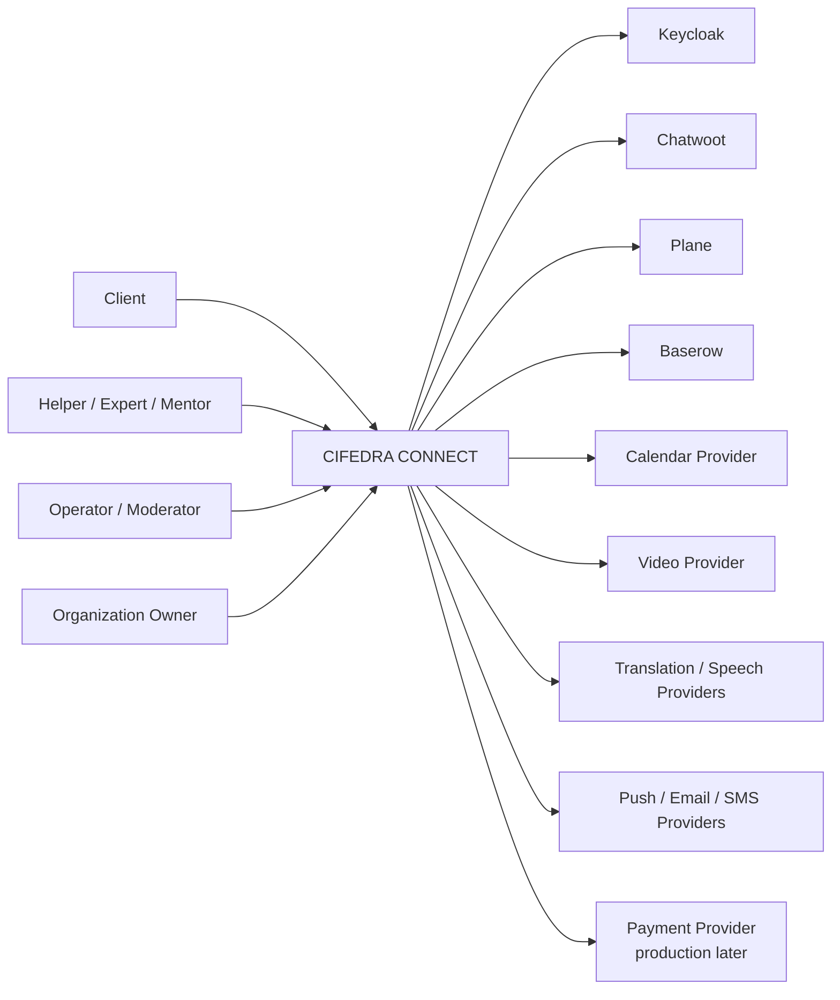
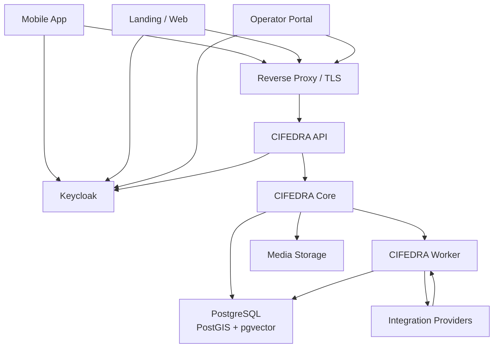
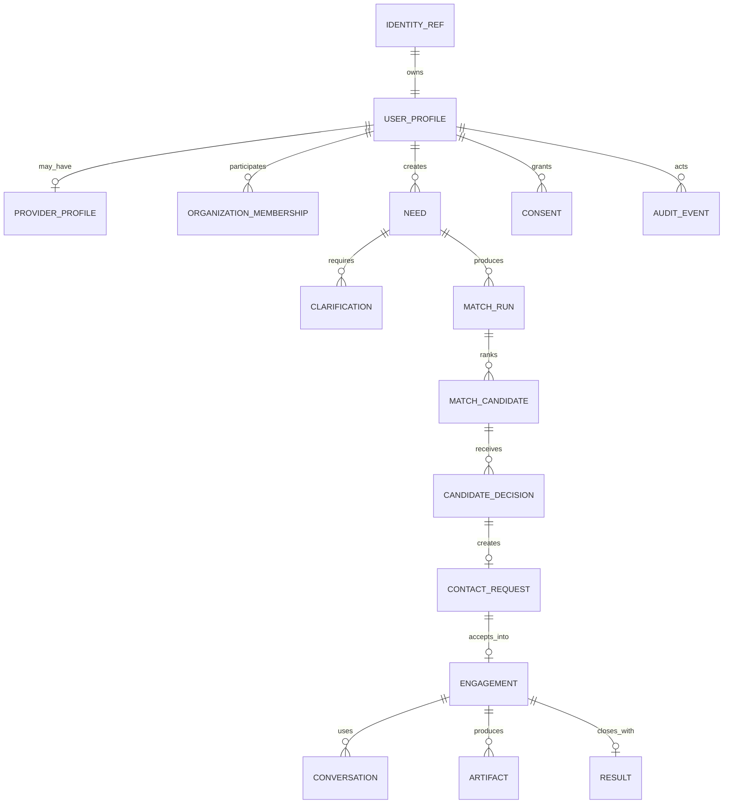

# CIFEDRA CONNECT: High-Level Design

Дата: 2026-06-20
Версия: HLD v0.1
Статус: draft for review

## 1. Назначение

HLD описывает целевую высокоуровневую архитектуру `CIFEDRA CONNECT` для
направлений `Life`, `Work`, `Skills`.

Документ определяет:

- границы продукта;
- основные контейнеры и компоненты;
- владельцев данных;
- интеграции;
- local, staging and production topology;
- security and reliability principles;
- последовательность реализации.

Связанные документы:

- [Целевая архитектура](./cifedra-target-architecture.md).
- [Аудит CJM и Core](./core-cjm-gap-analysis.md).
- [CJM по направлениям](../product/cjm-scenarios-gap-analysis.md).
- [CJM по ролям](../product/cjm-by-roles.md).
- [План авторизации](./auth-integration-plan.md).
- [Языки и голос](./multilingual-voice-plan.md).

## 2. Цели решения

1. Дать пользователю единый flow поиска полезного человека:

```text
Need
  -> Clarify
  -> Match
  -> Decide
  -> Request Contact
  -> Accept
  -> Connect
  -> Execute
  -> Result
```

2. Поддерживать разные правила `Life`, `Work`, `Skills` без создания трех
   независимых систем.
3. Собирать mobile-first продукт, не зависящий от UI Plane, Chatwoot, Baserow,
   Calendly или других внешних систем.
4. Позволять локальную разработку и тестирование до внешнего deployment.
5. Подключать production providers через заменяемые adapters.
6. Сохранять продуктовые данные и lifecycle в CIFEDRA.

## 3. Не входит в текущий scope

- production payment provider;
- payouts и marketplace settlement;
- direct user-to-helper messenger;
- live speech-to-speech translation;
- production video infrastructure;
- ML-обучение matching;
- multi-region deployment;
- отдельные микросервисы для каждого домена.

Эти зоны должны иметь контракты или extension points, но не реализуются до
подтверждения основного сценария.

## 4. Архитектурные драйверы

| Драйвер | Архитектурное следствие |
| --- | --- |
| Mobile-first | Versioned API, OIDC, push-ready notifications. |
| Self-host / modifiable | Open standards и open-source предпочтительнее SaaS lock-in. |
| Три направления | Общий lifecycle + direction-specific schemas and policies. |
| Ручной пилот | Baserow/Chatwoot/Plane доступны через adapters. |
| Privacy | Consent, disclosure policy, audit and data minimization. |
| Reliability | Transactional outbox, idempotent webhooks, external refs. |
| International use | Locale, timezone, languages, translation metadata. |
| Локальная разработка | Mock providers and Docker-based integrations. |
| Future commerce | Payment abstraction без хранения card data. |

## 5. System Context



## 6. Container Architecture

### 6.1 Контейнеры

| Контейнер | Ответственность | Технология / статус |
| --- | --- | --- |
| Mobile App | Клиентский и provider flow. | React Native + Expo, planned. |
| Web Landing | Информация и store links. | Static web, implemented. |
| Operator/Admin Portal | Queue, triage, moderation, catalog. | Custom web, planned. |
| CIFEDRA API | Public API, auth validation, DTO, policies. | Node.js/TypeScript, prototype. |
| CIFEDRA Core | Domain model and business rules. | TypeScript package, active. |
| CIFEDRA Worker | Outbox, notifications, adapters, retries. | Node.js/TypeScript, planned. |
| PostgreSQL | Product source of truth. | Planned. |
| Media Storage | Files, audio, artifacts. | Local filesystem dev; S3-compatible prod. |
| Keycloak | Authentication and IdP sessions. | Planned after identity boundary. |
| Integration Runtime | Chatwoot, Plane, Baserow and optional providers. | Docker/local and isolated prod. |
| Observability | Logs, metrics, traces and alerts. | Basic logs now; production stack later. |

### 6.2 Container diagram



## 7. Application Architecture

На MVP используем modular monolith + worker, а не набор микросервисов.

```text
apps/api
  -> packages/core
  -> repositories
  -> outbox

apps/worker
  -> outbox dispatcher
  -> notification adapters
  -> integration adapters
  -> media/language jobs
```

### 7.1 Core bounded modules

| Module | Responsibility |
| --- | --- |
| Identity Boundary | Normalize `issuer + subject` into principal. |
| Authorization | Ownership, permissions and organization scope. |
| Profile | User/provider profile, preferences, languages, visibility. |
| Catalog | Directions, categories and versioned intake schemas. |
| Need Intake | Draft, answers, completeness and clarification. |
| Matching | Match run, direction rules, explanation and version. |
| Decision | Candidate decision and shortlist. |
| Contact Request | Request, accept, decline, expiry and cancellation. |
| Consent | Disclosure permission and revocation. |
| Conversation | Channel, participants and state. |
| Engagement | Assignment, booking/task/session and execution status. |
| Trust & Safety | Verification, report, block, risk and moderation. |
| Result | Outcome, artifacts, proof, review and quality signal. |
| Notification | Notification intent and preference. |
| Language | Locale, requirements, translation/transcript metadata. |
| Organization | Tenant, membership, invitation and company access. |
| Commerce | Money, terms and payment provider references. |
| Audit | Actor, action, resource, reason and timestamp. |
| Events | Domain event, correlation, causation and idempotency. |

## 8. Data Architecture

### 8.1 Primary storage

PostgreSQL является единственным source of truth для product state.

Extensions:

- PostGIS for Life geography;
- pgvector for semantic candidate retrieval;
- PostgreSQL full-text search for initial search;
- outbox/inbox tables for integration reliability.

### 8.2 High-level entity groups



### 8.3 Media

PostgreSQL хранит metadata и access policy. Binary content хранится отдельно.

Local:

```text
.local/media/
```

Production:

```text
S3-compatible object storage
```

## 9. Identity and Security

### 9.1 Authentication

- Keycloak is production/staging IdP.
- Mobile uses Authorization Code through external browser + PKCE.
- API validates issuer, audience, signature and expiration.
- Local auth remains test adapter.

### 9.2 Authorization

Keycloak roles не заменяют Core policies.

Core проверяет:

- owner of Need/Profile/Artifact;
- organization membership;
- operator/moderator scope;
- consent and data disclosure;
- risk category policy;
- resource visibility.

### 9.3 Sensitive data

- exact address скрыт до разрешенного шага;
- cards/payment credentials не хранятся;
- external provider tokens хранятся только в secrets storage;
- audio and transcripts have retention policy;
- administrative override is audited;
- account and data deletion flow обязателен до production.

## 10. Integration Architecture

Все интеграции реализуются через ports/adapters.

```text
Core Domain Event
  -> Transactional Outbox
  -> Worker
  -> Provider Adapter
  -> External Service
  -> Webhook
  -> Inbox Deduplication
  -> Domain Command
```

### 10.1 Integration matrix

| Integration | Purpose | Source of truth | Local mode | Production decision |
| --- | --- | --- | --- | --- |
| Chatwoot | Support/concierge. | Chatwoot for messages; Core for product state. | Live local container. | Keep behind adapter. |
| Plane | Operational tasks. | Plane task + Core engagement projection. | Draft/local container. | Keep internal. |
| Baserow | Pilot backoffice. | Never product source of truth. | Planned local. | Remove or retain as projection. |
| Calendly | SaaS scheduling integration. | Core Booking. | Not required. | Optional adapter. |
| Cal.diy | Self-host scheduling spike. | Core Booking. | Optional experiment only. | Not recommended as prod dependency. |
| Jitsi | Video meeting. | Core Booking/Conversation. | Deferred. | Optional adapter. |
| Argos Translate | Offline text translation. | Core original + translation record. | Candidate for local spike. | Compare quality. |
| Whisper | Speech transcription/language detection. | Core media/transcript metadata. | Candidate for local spike. | Replaceable provider. |
| n8n | Internal automation. | Never product source of truth. | Not needed for MVP. | Optional after event contracts. |
| Payment Provider | Payment processing. | PSP record + Core projection. | Mock only. | Real provider before commercial production. |

## 11. Scheduling

Core owns:

- availability;
- slots;
- timezone;
- booking;
- confirmation;
- reschedule;
- cancellation;
- no-show;
- meeting external reference.

Calendly or another provider is an adapter. A booking link alone does not
replace Core Booking because CIFEDRA needs status, result and quality loop.

## 12. Languages and Voice

```text
Audio
  -> Media Storage
  -> SpeechTranscriptionProvider
  -> Transcript
  -> optional TextTranslationProvider
  -> user review
```

Whisper:

- transcription;
- language identification;
- audio-to-English translation.

Argos Translate:

- offline text translation candidate;
- arbitrary supported language pairs;
- local quality must be measured.

UI localization remains a separate resource-based i18n process.

## 13. Automation and n8n

n8n is not required for Core or Mobile MVP.

Allowed target use:

- internal reports;
- CRM/backoffice sync;
- non-critical notifications;
- manual operations;
- support automations.

Prohibited as source of truth:

- matching;
- lifecycle transitions;
- permissions;
- consent;
- moderation;
- payment state;
- audit.

Default implementation: custom workers consuming domain events.

## 14. Payments

### 14.1 Local

- `MockPaymentProvider`;
- test money only;
- deterministic webhook fixtures;
- no card data and no PSP secrets.

### 14.2 Production

Payment provider selection is deferred until:

- legal entity and jurisdiction are known;
- supported countries/currencies are known;
- marketplace vs direct payment model is approved;
- commissions, payouts, taxes, refunds and disputes are specified.

Integration requirements:

- hosted checkout/tokenization;
- signed webhooks;
- idempotency;
- reconciliation;
- refund/dispute states;
- PCI scope minimization.

## 15. Deployment Architecture

### 15.1 Current local

| Component | Status |
| --- | --- |
| Core/API | Running locally. |
| Landing/Test Console | Running locally. |
| Local Auth | Running locally. |
| Chatwoot | Installed and tested. |
| Plane | Installed/draft integration. |
| PostgreSQL Core | Not yet added. |
| Keycloak | Not yet added. |
| Baserow | Planned. |

### 15.2 Target local

```text
Docker / local processes
  - cifedra-api
  - cifedra-worker
  - postgres
  - keycloak
  - chatwoot
  - plane
  - baserow
  - optional argos/whisper spike

Mocks
  - notifications
  - calendar
  - payments
  - object storage via local filesystem
```

Компоненты включаются профилями, чтобы не запускать весь стек для каждого теста.

### 15.3 Staging

- production-like Keycloak/PostgreSQL;
- test domains and TLS;
- sandbox notification/calendar/payment providers;
- isolated test data;
- migrations and backup validation;
- TestFlight/Google Play internal builds.

### 15.4 Production

- reverse proxy/load balancer and TLS;
- stateless API replicas;
- worker replicas;
- PostgreSQL backups and point-in-time recovery;
- object storage;
- Keycloak backup and key rotation;
- secrets management;
- metrics/logs/traces/alerts;
- signed provider webhooks;
- real payment provider;
- privacy, terms and deletion endpoints.

## 16. Non-Functional Requirements

| Area | HLD requirement |
| --- | --- |
| Security | OIDC, least privilege, audit, encryption in transit. |
| Reliability | Idempotent commands/webhooks, outbox/inbox, retry with limits. |
| Data integrity | Transactions, optimistic locking and versioned migrations. |
| Performance | Match and API SLO are specified before staging load tests. |
| Availability | Production SLO and RTO/RPO are defined before launch. |
| Privacy | Consent, retention, deletion and disclosure trail. |
| Accessibility | Mobile/web accessibility and voice input support. |
| Localization | Locale/timezone/language metadata from first persistent schema. |
| Replaceability | External providers accessible only through adapters. |
| Observability | Correlation IDs across API, worker and integrations. |
| Testability | Local mocks, contract tests, smoke and E2E scenarios. |

## 17. Architecture Decisions

| ID | Decision | Status |
| --- | --- | --- |
| ADR-001 | Modular monolith + worker before microservices. | Accepted. |
| ADR-002 | PostgreSQL is Core source of truth. | Accepted. |
| ADR-003 | Keycloak for staging/production authentication. | Accepted. |
| ADR-004 | Plane/Chatwoot/Baserow remain replaceable adapters. | Accepted. |
| ADR-005 | Core owns Booking; Calendly is optional. | Accepted. |
| ADR-006 | Whisper is speech provider, not universal translator. | Accepted. |
| ADR-007 | Custom workers first; n8n optional internal automation. | Accepted. |
| ADR-008 | Payment contract now, real provider only before production pilot. | Accepted. |
| ADR-009 | Direct product chat is separate future SRS. | Deferred. |

## 18. Risks

| Risk | Mitigation |
| --- | --- |
| Too many local containers | Compose profiles and staged enablement. |
| External product licensing changes | Adapter boundary and periodic license review. |
| Core API frozen before domain completion | Finish CJM P0 gaps before OpenAPI freeze. |
| Keycloak operational overhead | Add only after identity boundary and PostgreSQL. |
| Poor automatic translation | Provider evaluation, confidence and user correction. |
| Sensitive audio leakage | Consent, retention and provider policy. |
| n8n becomes hidden core | Restrict it to internal non-critical automation. |
| Payment compliance expands scope | Mock locally; legal/financial SRS before provider. |
| Plane/Chatwoot status drift | Outbox/inbox and reconciliation jobs. |

## 19. Open Questions

1. Какие языки входят в первый pilot?
2. Нужен ли voice input в Mobile MVP или в следующей итерации?
3. Какой сценарий первым требует Booking: Skills, Work или Care?
4. Нужен ли пользователям direct chat или concierge достаточно для pilot?
5. Какая юридическая модель будет у production payments?
6. Нужны ли organizations в первом Work pilot?
7. Какие данные можно передавать внешним translation/speech providers?
8. Какая редакция Plane/Chatwoot поддержит operator SSO?

## 20. Implementation Roadmap

### Phase 1. Core Completion

- IdentityRef/Profile;
- Need Intake/Clarification;
- Contact Request/Acceptance;
- Engagement;
- Consent/Trust/Audit.

### Phase 2. Persistence and API

- PostgreSQL;
- repositories/migrations;
- outbox/inbox;
- versioned API/OpenAPI.

### Phase 3. Identity and Mobile

- Keycloak local/staging;
- OIDC mobile flow;
- Mobile shell and primary CJM.

### Phase 4. Operations

- Baserow/operator portal;
- Chatwoot/Plane event sync;
- notifications;
- monitoring.

### Phase 5. Optional Capabilities

- language and transcription;
- booking/calendar;
- video;
- internal n8n automation.

### Phase 6. Production and Commerce

- staging acceptance;
- production infrastructure;
- real payment provider;
- store publication.

## 21. HLD Acceptance Criteria

HLD можно утвердить, когда:

1. Согласованы system boundary and data ownership.
2. Подтвержден modular monolith + worker.
3. Подтвержден Keycloak как target IdP.
4. Подтверждены границы Plane/Chatwoot/Baserow.
5. Подтвержден provider-neutral scheduling.
6. Подтверждено, что Whisper не заменяет text translation.
7. Подтверждена необязательность n8n для MVP.
8. Подтвержден mock-only payment layer до production.
9. Открытые вопросы перенесены в SRS/ADR backlog.
