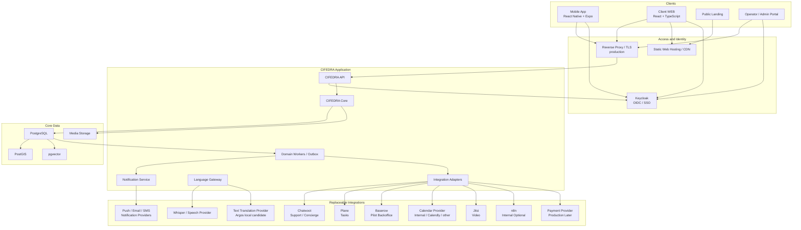

# CIFEDRA CONNECT: целевая архитектура

Дата: 2026-06-20
Статус: target architecture v0.3

## Назначение

Документ является канонической архитектурой решения. Он объединяет CJM,
текущий прототип, open-source интеграции и будущий production-контур.

Формальное представление контейнеров, данных, deployment и NFR:
[cifedra-hld.md](./cifedra-hld.md).

Утвержденные решения: [../adr/README.md](../adr/README.md).

Основной принцип:

```text
CIFEDRA owns product state and business rules.
External systems provide replaceable capabilities through adapters.
```

## Архитектурные решения

| Зона | Решение |
| --- | --- |
| Product Core | Самописный `CIFEDRA Core`. |
| Architecture style | Модульный монолит + отдельный worker; не микросервисы на этапе MVP. |
| Mobile | React Native + Expo. |
| Client WEB | React + TypeScript + Vite, адаптивный пользовательский интерфейс. |
| Other Web | Отдельные Landing и будущий operator/admin portal. |
| API | Самописный versioned CIFEDRA API. |
| Identity | Keycloak для staging/production; local auth adapter для разработки. |
| Core Data | PostgreSQL 18; PostGIS 3.6.4 и pgvector 0.8.3 как расширения. |
| Files/Media | Локальная файловая система в dev; S3-compatible adapter в production. |
| Search | PostgreSQL FTS + pgvector сначала; Meilisearch/Qdrant только при росте. |
| Support | Chatwoot как concierge/support adapter. |
| Tasks | Plane как execution/task adapter. |
| Backoffice | Baserow как временный операционный слой. |
| Scheduling | Собственный Booking/Availability core + заменяемый calendar provider. |
| Video | Jitsi adapter после SRS встреч. |
| Languages | UI i18n + Text Translation Provider + Speech Transcription Provider. |
| Whisper | Опциональный transcription provider, не универсальный переводчик. |
| Automation | Собственные workers; n8n только для внутренних некритичных процессов. |
| Notifications | Product notification service + replaceable push/email/SMS providers. |
| Observability | Structured logs локально; metrics/traces/alerts в production. |
| Payments | Payment Provider adapter; mock локально, реальный PSP только в production. |

## Логическая схема



## CIFEDRA Core

`Life`, `Work`, `Skills` используют общие модули и таблицы с разными intake
schemas и policies. Они не являются отдельными backend services.

### Обязательные модули

| Группа | Модули |
| --- | --- |
| Identity boundary | `IdentityRef`, normalized principal, authorization policies. |
| People | User Profile, Provider Profile, Organization, Membership. |
| Need | Intake schema, Need, Clarification, attachments and readiness. |
| Match | Match Run, Candidate, score breakdown, manual override. |
| Decision | Client Decision, Shortlist, Contact Request. |
| Acceptance | Provider Accept/Decline/Expire. |
| Trust | Verification, Consent, Disclosure, Report, Block, Moderation. |
| Communication | Brief, Conversation state and participants. |
| Execution | Engagement, Assignment, Booking, task/session state. |
| Result | Outcome, artifact/proof, review and quality signal. |
| Platform | Domain Events, Audit, Notifications, Repository ports. |
| Language | Locale, languages, translation/transcript metadata. |
| Commerce | Money, price terms and provider-neutral payment references. |

Подробный gap register:
[core-cjm-gap-analysis.md](./core-cjm-gap-analysis.md).

## Identity и Keycloak

### Решение

Keycloak нужен для общей авторизации в staging/production:

- mobile, web и operator portal используют один OIDC IdP;
- CIFEDRA API проверяет access token;
- login, registration, email verification, password reset, MFA, sessions,
  passkeys и federation не пишутся в Core;
- Core использует стабильный ключ `issuer + subject`, а не email;
- продуктовые Profile, Membership, Consent и Trust остаются в CIFEDRA DB.

### Clients

| Client | Тип |
| --- | --- |
| `cifedra-mobile` | Public OIDC client, Authorization Code через системный browser + PKCE. |
| `cifedra-web` | Public SPA OIDC client, Authorization Code + PKCE, tokens in memory. |
| `cifedra-api` | Resource server / audience. |
| `cifedra-ops` | Operator/admin portal with stronger authentication policy. |
| Service integrations | Service accounts only where necessary. |

Plane и Chatwoot не становятся identity source. Их UI SSO подключается позже
только для операторов и только после проверки поддержки OIDC/SAML в выбранной
редакции.

## Языки и онлайн-перевод

### Состав

```text
UI i18n
  + User locale/timezone
  + Profile spoken languages
  + Need language requirements
  + Text Translation Provider
  + Speech Transcription Provider
  + optional Speech Translation Provider
```

### Whisper

Whisper подходит для:

- голосового создания Need;
- voice notes;
- transcription встреч;
- language identification;
- перевода аудио в английский текст.

Whisper не переводит интерфейс и не заменяет text translation service. Для
перевода `русский -> испанский`, `английский -> русский` и других произвольных
пар нужен отдельный provider.

Для локального spike выбираем `Argos Translate` как MIT/offline candidate.
`LibreTranslate` можно проверить как готовый HTTP API, но он использует
AGPL-3.0 и требует отдельного license review.

Core хранит:

- original language;
- original content reference;
- translated/transcribed version;
- provider and model reference;
- status/confidence;
- consent and retention policy.

Подробный план:
[multilingual-voice-plan.md](./multilingual-voice-plan.md).

## Scheduling: Calendly, Cal.diy или собственный модуль

### Решение

Источник истины по встрече должен находиться в CIFEDRA Core:

```text
Availability -> Slot -> Booking -> Confirmed -> Completed / Cancelled / No-show
```

Внешний календарь получает/возвращает external reference и события.

### Варианты

| Вариант | Роль в архитектуре | Решение |
| --- | --- | --- |
| Internal slots | Минимальный booking lifecycle в Core. | BUILD, P1. |
| Calendly | SaaS API/embed/link integration. | OPTIONAL adapter, не модифицируется и не source of truth. |
| Cal.diy | MIT community self-hosted scheduling. | Только local spike; проект предупреждает о non-production использовании. |
| Calendar APIs | Google/Microsoft/Apple-compatible calendar sync. | Позже через adapters. |

Для локального MVP достаточно internal/mock calendar adapter. Calendly не
нужно устанавливать локально.

## n8n

### Нужен ли n8n

Для ядра и первого Client Applications MVP: нет.

Он может быть полезен позже как внутренний automation tool:

- выгрузить операционный отчет;
- синхронизировать Baserow/CRM;
- отправить некритичное письмо;
- создать внутреннее уведомление;
- запустить ручной backoffice workflow;
- связать внутренние сервисы компании.

### Что нельзя отдавать n8n

- matching и ranking;
- Need/Contact/Engagement lifecycle;
- authorization и consent;
- trust/safety decisions;
- платежные статусы и возвраты;
- audit source of truth;
- обязательную доставку domain events.

n8n использует Sustainable Use License и разрешает многие internal business
use cases, но не является классическим open-source компонентом. Если ценность
платного продукта существенно зависит от n8n или используются credentials
конечных пользователей, требуется отдельный license/commercial review.

### Итог

```text
CUSTOM workers first.
n8n optional after stable domain events.
```

## Payments

### Решение сейчас

Платежный слой указываем в архитектуре, но реальный provider не подключаем до
production deployment и отдельного юридического/финансового SRS.

Core должен заранее иметь provider-neutral model:

| Сущность | Назначение |
| --- | --- |
| `Money` | Amount + currency. |
| `PriceTerms` | Fixed/hourly/free/exchange and cancellation terms. |
| `PaymentIntentRef` | Internal ID + external provider reference. |
| `PaymentStatus` | created/pending/authorized/paid/failed/cancelled/refunded. |
| `RefundRef` | External refund reference and reason. |
| `PaymentEvent` | Idempotent provider webhook event. |

### Local

- `MockPaymentProvider`;
- тестовые статусы без денег;
- никаких банковских карт и production credentials;
- сценарии оплаты проверяются contract tests.

### Production later

- выбрать PSP по стране юридического лица, валютам и marketplace-модели;
- использовать hosted payment page/tokenization;
- не хранить card data в CIFEDRA;
- включить signature verification, idempotency and reconciliation;
- отдельно описать комиссии, payouts, refunds, disputes and taxes.

## Data ownership

| Данные | Владелец |
| --- | --- |
| Credentials, IdP sessions, MFA | Keycloak. |
| Product profile and preferences | CIFEDRA DB. |
| Need, Match, Contact Request, Engagement, Result | CIFEDRA DB. |
| Consent, Trust, Moderation, Audit | CIFEDRA DB. |
| Chatwoot messages | Chatwoot. |
| Product conversation state and Chatwoot reference | CIFEDRA DB. |
| Plane task fields and operator workflow | Plane. |
| Engagement lifecycle and Plane reference | CIFEDRA DB. |
| Baserow records | Pilot projection, не source of truth. |
| Booking | CIFEDRA DB; calendar provider is synchronized projection. |
| Media metadata | CIFEDRA DB. |
| Audio/files | Media storage. |
| Transcript/translation metadata | CIFEDRA DB. |
| Payment transaction/settlement fact | PSP. |
| Payment intent and verified projection | CIFEDRA DB. |
| n8n execution | Internal automation log, не product source of truth. |

## Eventing

На старте Kafka/RabbitMQ не нужны.

Используем:

```text
PostgreSQL transaction
  -> domain state
  -> outbox event
  -> worker
  -> adapter/provider
  -> API webhook ingress
  -> inbox deduplication
  -> worker
  -> domain update
```

Это закрывает reliability интеграций без раннего усложнения инфраструктуры.
Синхронные API описываются OpenAPI 3.1, events используют CloudEvents 1.0,
ошибки API соответствуют RFC 9457.

## Notifications

Core создает не письмо или push, а `NotificationIntent`:

```text
event
  -> notification policy
  -> recipient preference
  -> channel selection
  -> provider adapter
  -> delivery status
```

Локально используется log/mock provider. Production providers для push,
email и SMS выбираются отдельно. n8n не является обязательным delivery layer.

## Search

На старте достаточно:

- PostgreSQL full-text search для каталогов и операционных данных;
- pgvector для semantic candidate retrieval;
- PostGIS для географии.

Meilisearch или Qdrant подключаются только после появления измеримой проблемы
объема, latency или сложных фильтров.

## Локальный контур

### Уже есть

- CIFEDRA Core/API;
- landing/test console;
- local file auth;
- Plane;
- Chatwoot;
- Docker;
- smoke tests and handoff.

### Добавляем последовательно

1. Tracked `cifedra-core` compose project с PostgreSQL 18/PostGIS/pgvector.
2. Repository ports, migrations and outbox.
3. Keycloak local realm and OIDC adapter.
4. Baserow pilot backoffice.
5. Mock notification/calendar/payment providers.
6. Local media storage.
7. Whisper transcription spike.
8. Argos Translate text translation spike.
9. Jitsi and n8n only when соответствующий CJM готов к проверке.

Локально это единое управляемое окружение, но не один контейнер: Core,
Identity, Chatwoot, Plane и Baserow запускаются отдельными compose projects и
profiles с отдельными volumes/databases. Не нужно поднимать все контейнеры
одновременно до появления проверяемого сценария.

## Production-контур

```text
Internet
  -> TLS / Reverse Proxy
  -> CIFEDRA API + Workers
  -> PostgreSQL / PostGIS / pgvector
  -> Media Storage
  -> Keycloak
  -> Internal Integrations
      -> Chatwoot
      -> Plane
      -> Baserow if still needed
      -> Calendar / Video / Translation
      -> Payment Provider
```

Production добавляет:

- staging environment;
- secrets management;
- backups and restore tests;
- metrics, logs and traces;
- rate limiting and WAF policy;
- signed webhooks;
- migrations and rollback;
- data retention/deletion;
- real payment provider;
- store builds and public URLs.

Secrets, signing keys, payment credentials and provider tokens не хранятся в
Git или Baserow.

## Build / Integrate / Defer

| Компонент | Решение |
| --- | --- |
| Core domain, match, consent, trust, execution, result | BUILD. |
| Mobile, client WEB and operator UX | BUILD. |
| PostgreSQL/PostGIS/pgvector | INTEGRATE. |
| Keycloak | INTEGRATE/MODIFY. |
| Chatwoot, Plane, Baserow | INTEGRATE/MODIFY behind adapters. |
| Text translation / Whisper | INTEGRATE behind Language Gateway. |
| Scheduling | BUILD lifecycle; OPTIONAL external adapter. |
| Jitsi | DEFER until video scenario. |
| n8n | OPTIONAL internal use after event contracts. |
| Payments | DEFINE adapter now; CONNECT only before production pilot. |
| Direct product chat | DEFER to separate SRS. |

## Порядок реализации

1. Завершить core gaps из CJM.
2. Перейти с local files на PostgreSQL and repository contracts.
3. Зафиксировать versioned API/OpenAPI.
4. Подключить Keycloak локально.
5. Собрать mobile и client WEB shells с общим happy path.
6. Добавить Baserow/operator queue and integration event sync.
7. Добавить languages and optional transcription.
8. Добавить booking/video по Skills/Work pilot.
9. Подготовить staging/production.
10. Подключить реальный payment provider перед коммерческим production pilot.

## Источники

- [Keycloak Server Administration](https://www.keycloak.org/docs/latest/server_admin/).
- [Keycloak Apache-2.0 license](https://github.com/keycloak/keycloak/blob/main/LICENSE.txt).
- [OAuth 2.0 for Native Apps](https://www.rfc-editor.org/rfc/rfc8252).
- [OpenAI Whisper](https://github.com/openai/whisper).
- [OpenAI Speech to text](https://developers.openai.com/api/docs/guides/speech-to-text).
- [Argos Translate](https://github.com/argosopentech/argos-translate).
- [LibreTranslate](https://github.com/LibreTranslate/LibreTranslate).
- [n8n Sustainable Use License](https://docs.n8n.io/sustainable-use-license/).
- [Calendly Developer API](https://developer.calendly.com/).
- [Cal.diy repository](https://github.com/calcom/cal.diy).
- [Jitsi Meet license](https://github.com/jitsi/jitsi-meet/blob/master/LICENSE).
